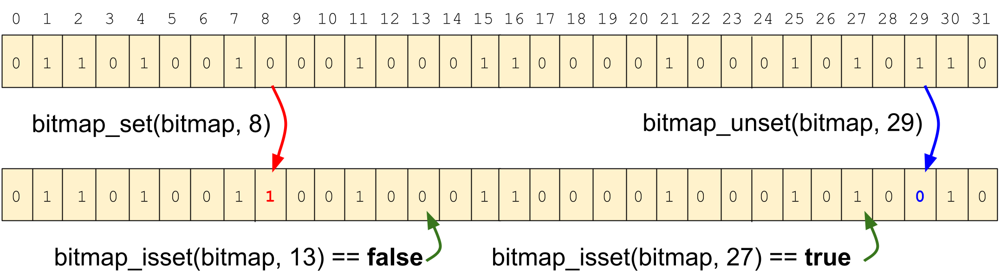

XDP2 Bitmaps
============

The XDP2 API supports rich bitmaps API attuned to handle multi-word bitmaps
with functions that are amenable to hradware acceleration.

A bitmap is an array of bits. Each bit can be one or zero and we apply some
semantics to the bit at a particular index. Typically, each bit index refers
to some object and the bit setting implies a state for the object.

A bitmap is defined by a word size __u{8,16,32,64} and a number of bits
(nbits). A bitmap may be contained in single word, i.e. a single-word bitmap,
or may span multiple words in a multi-word bitmap. The bits are numbered
starting with the lowest order bit of the first word.  The most basic
operations of a bitmap are set a bit, unset a bit, and check if a bit is
set.

<figure class="image">
    
    <figcaption> An example bitmap show the basic operations of "set",
    "unset" and "isset"
    </figcaption>
</figure>

Single word bitmaps
===================

The simplest bitmaps are contained in a single-word: like an eight bit,
sixteen bit, thirty-two bit, sixty-four bit word, etc. The basic operations
are set a bit, clear a bit, and check if a bit is set. Implementing these are
straightforward **O**(1) operations, it’s just a matter of applying a few
shifts and boolean operations.

The single word XDP2 bitmap functions have the name format:
```
xdp2_bitmap_wordN_OP
```

where *N* is 8, 16, 32, or 64 and *OP* is the operation.

Set, unset, isset
-----------------

Basic bitmap manipulation functions are:

```C
void xdp2_bitmap_wordN_set(__uN bitmap, unsigned int index)
void xdp2_bitmap_wordN_unset(__uN bitmap, unsigned int index)
bool xdp2_bitmap_wordN_isset(__uN bitmap, unsigned int index)
```

Hamming weight
--------------

Return the number of bits set in a bitmap.

```C
unsigned int xdp2_bitmap_wordN_weight(__uN bitmap)
```

Find first set or zero bit bit
------------------------------

Find the first set bit or unset bit (zero bit) in a bitmap. Optionally, a
start position may be specified.

```C
unsigned int xdp2_bitmap_wordN_find(__uN bitmap)
unsigned int xdp2_bitmap_wordN_find_start(__uN bitmap, unsigned int pos)
unsigned int xdp2_bitmap_wordN_find_zero(__uN bitmap)
unsigned int xdp2_bitmap_wordN_find_zero_start(__uN bitmap, unsigned int pos)

```

foreach macros
--------------

Macros to walk over the set or unset bits in a bitmap.

```C
xdp2_bitmap_wordN_foreach_bit(WORD, POS) {
     /* Process set bit index in variable in POS */
}

xdp2_bitmap_wordN_foreach_zero_bit(WORD, POS) {
     /* Process zero bit index in variable in POS */
}
```

Reverse find first set or zero bit bit
--------------------------------------

Find the last set bit or unset bit (zero bit) in a bitmap.Optionally, a
start position may be specified.

```C
unsigned int xdp2_bitmap_wordN_rev_find(__uN bitmap)
unsigned int xdp2_bitmap_wordN_rev_find_start(__uN bitmap, unsigned int pos)
unsigned int xdp2_bitmap_wordN_rev_find_zero(__uN bitmap)
unsigned int xdp2_bitmap_wordN_rev_find_zero_start(__uN bitmap,
						   unsigned int pos)
```

Reverse foreach macros
----------------------

Macros to walk over the set or unset bits in a bitmap in reverse (starting
from the last bit position).

```C
xdp2_bitmap_wordN_rev_foreach_bit(WORD, POS) {
     /* Process set bit index in variable in POS */
}

xdp2_bitmap_wordN_rev_foreach_zero_bit(WORD, POS) {
     /* Process zero bit index in variable in POS */
}
```

Rotate
------

Rotate the bits in a bitmap left or right.

```C
__uN xdp2_bitmap_word_rolN(__uN bitmap, unsigned int num_rotate)
__uN xdp2_bitmap_word_rorN(__uN bitmap, unsigned int num_rotate)
```

Multi-word bitmaps
==================

A multi-word bitmap is composed of one or more words. In the XDP2, bitmap
functions act on words that have type *unsigned long* or *__u8*, *__u16*,
*__u32*, or *__u64*.  Bitmaps are passed to functions as pointers.

If *N* is the number of bits in each word, and *NBITS* is the total number of
bits in a bitmap, then the total number of words in the bitmap is:

```C
      NUM_WORDS = (NBITS + N - 1) / N
```

Endianess and word ordering
---------------------------

There are four variants of bitmaps with regard to endianess. The words of a
bitmap may be little endian or big endian, and the array of words in a
multi-word bitmap may be counted from zero up in increasing word ordering
(like normal array indexing), or may be counted from maximum number of words
down to zero in decreasing word ordering. So the four variants are:

* Little endian words and increasing word ordering
* Little endian words and decreasing word ordering
* Big endian words and increasing word ordering
* Big endian words and decreasing word ordering

<figure class="image">
    
    <figcaption> Bit numbering for a bitmap with three sixteen bit words.
    On the left the number for lttle endian words and increasing word
    ordering is shown, and on the right the numbering for big endian words
    and decreasing word ordering is shown.
    </figcaption>
</figure>

Increasing word ordering
------------------------

Assuming word endianness is host endianness, i.e. an internal bitmap that
can be either little endian or big endian, if the words size is *N*,
the number of bits in the bitmap is *NBITS*, and *NUM_WORDS* is the number of
words in the bitmap, then the bits are counted as:

```
      bit_0 = addr[0] & (1 << 0)
      bit_1 = addr[0] & (1 << 1)
      bit_2 = addr[0] & (1 << 2)
      ...
      bit_(N-2) = addr[0] & (1 << (N-2))
      bit_(N-1) = addr[0] & (1 << (N-1))
      bit_(N) = addr[1] & (1 << 0)
      bit_(N+1) = addr[1] & (1 << 1)
      bit_(N+2) = addr[1] & (1 << 2)
      ...
      bit_(2*N-2) = addr[1] & (1 << (N-2))
      bit_(2*N-1) = addr[1] & (1 << (N-1))
      bit_(2*N) = addr[1] & (1 << 0)
      ...
      bit_(NBITS - 1) = addr[NUM_WORDS - 1] & (1 << ((NBITS - 1) % N))
```

Decreasing word ordering
------------------------

Reverse bitmaps structure the words in decreasing order. Assuming word
endianness is host endianness, i.e. an internal bitmap can be either
little endian or big endian, if the words size is N, the number of bits in
the bitmap is *NBITS*, and *NUM_WORDS* is the number of words in the bitmap,
then the bits in a reverse bitmap are counted as:

```
      bit_0 = addr[NUM_WORDS - 1] & (1 << 0)
      bit_1 = addr[NUM_WORDS - 1] & (1 << 1)
      bit_2 = addr[NUM_WORDS - 1] & (1 << 2)
      ...
      bit_(N-2) = addr[NUM_WORDS - 1] & (1 << (N-2))
      bit_(N-1) = addr[NUM_WORDS - 1] & (1 << (N-1))
      bit_(N) = addr[NUM_WORDS - 2] & (1 << 0)
      bit_(N+1) = addr[NUM_WORDS - 2] & (1 << 1)
      bit_(N+2) = addr[NUM_WORDS - 2] & (1 << 2)
      ...
      bit_(2*N-2) = addr[NUM_WORDS - 2] & (1 << (N-2))
      bit_(2*N-1) = addr[NUM_WORDS - 2] & (1 << (N-1))
      bit_(2*N) = addr[NUM_WORDS - 2] & (1 << 0)
      ...
      bit_(NBITS - 1) = addr[0] & (1 << ((NBITS - 1) % N))
```

Note that decreasing word ordering is more expensive than increasing word
ordering in bitmap operations since an extra subtraction operation is
required. Also, decreasing word ordering functions require an extra argument
that gives the number of words in the bitmap. Unless decreasing ordering is an
external requirement, say per a network protocol, increasing ordering is
recommended.

Applying word endianess
-----------------------

In the above examples word endianess could be applied when the word is
accessed. For instance, a multi-word bitmap might be both big endian
and decreasing word order (i.e. network byte order applied to a multi-
word bitmap). In this case, assuming 64-bit words, numbering would be:

```
      bit_0 = ntoll(addr[NUM_WORDS - 1]) & (1 << 0)
      bit_1 = ntoll(addr[NUM_WORDS - 1]) & (1 << 1)
      bit_2 = ntoll(addr[NUM_WORDS - 1]) & (1 << 2)
      ...
      bit_(N-2) = ntoll(addr[NUM_WORDS - 1]) & (1 << (N-2))
      bit_(N-1) = ntoll(addr[NUM_WORDS - 1]) & (1 << (N-1))
      bit_(N) = ntoll(addr[NUM_WORDS - 2]) & (1 << 0)
      bit_(N+1) = ntoll(addr[NUM_WORDS - 2]) & (1 << 1)
      bit_(N+2) = ntoll(addr[NUM_WORDS - 2]) & (1 << 2)
      ...
      bit_(2*N-2) = ntoll(addr[NUM_WORDS - 2]) & (1 << (N-2))
      bit_(2*N-1) = ntoll(addr[NUM_WORDS - 2]) & (1 << (N-1))
      bit_(2*N) = ntoll(addr[NUM_WORDS - 2]) & (1 << 0)
      ...
      bit_(nbits - 1) = ntohll(addr[0] & (1 << ((nbits - 1) % N))
```

Bitmap operations format
------------------------

XDP2 bitmap operation functions have the general format:
```C
    xdp2_bitmap[8, 16, 32, 64, ][swp]_< operation>](bitmap, ARGS, ...)
    xdp2_rbitmap[8, 16, 32, 64, ][swp]_< operation>](bitmap, ARGS, ...,
						     NUM_WORDS)
```

The bitmap word size is expressed as 8, 16, 32, or 64 bits. If the size
number is not present then the default word type is *unsigned long*
(typically sixty-four bits).

**swp** indicates that the bytes of a word are swapped for endinanness.

*operation* gives the bitmap operation (see below). The 'bitmap' argument
is the input bitmap as a pointer to the first word,  and the *ARGS* list
gives the arguments for the operation

If the **r** is present before the "bitmap then the bitmap is treated as
a reverse bitmap. *NUM_WORDS* is the last argument in the argument list.

If **wsrc** is present then the first source operand is single-word and not
a multi-word bitmap. This acts as a pattern that can be applied to
operations on the second source operand.

If **destsrc** is present then the destination bitmap is also the (second)
source operand.

Get and set functions
---------------------

Basic operations to set or get the value of a bit in a bitmap are:

* xdp2_[r]bitmap[N][swp]_set: Set a bit in the bitmap
* xdp2_[r]bitmap[N][swp]_setval: Set a bit to 0 or 1
* xdp2_[r]bitmap[N][swp]_unset: Clear a bit in the bitmap (set to 0)
* xdp2_[r]bitmap[N][swp]_isset: Return true if a bit is set in the bitmap

Functions:
```C
    void xdp2_bitmap[N][swp]_set(__uN *src, unsigned int pos)

    bool xdp2_bitmap[N][swp]_set_val(__uN *src, unsigned int pos,
				     bool val)

    void xdp2_bitmap[N][swp]_unset(const __uN *src, unsigned int pos)

    bool xdp2_bitmap[N][swp]_isset(const __uN *src, unsigned int pos)

    void xdp2_rbitmap[N][swp]_set(__uN *src, unsigned int pos,
				  unsigned int num_words)

    bool xdp2_rbitmap[N][swp]_set_val(__uN *src, unsigned int pos,
				      bool val, unsigned int num_words)

    void xdp2_rbitmap[N][swp]_unset(const __uN *src, unsigned int pos,
				    unsigned int num_words)

    bool xdp2_rbitmap[N][swp]_isset(const __uN *src, unsigned int pos,
				    unsigned int num_words)
```

Iterators
---------

Iterate over the set or unset bits in a bitmap. *pos* argument is variable
that gives the initial position and is then set to the matching bit index
for each iteration

* xdp2_[r]bitmap[N][swp]_foreach_bit
* xdp2_[r]bitmap[N][swp]_foreach_zero_bit

Macro usage:

```C
    xdp2_bitmap[N][swp]_foreach_bit(map, pos, nbits) {
	<code>
    }

    xdp2_bitmap[N][swp]_foreach_zero_bit(map, pos, nbits) {
	<code>
    }

    xdp2_rbitmap[N][swp]_foreach_bit(map, pos, nbits, num_words) {
	<code>
    }

    xdp2_bitmap[N][swp]_foreach_zero_bit(map, pos, nbits, num_words) {
	<code>
    }
```

Test functions
--------------

Test bitmap for all zeroes, all ones, weight. A *test* argument specifies
the particular test.

* xdp2_[r]bitmap[N][swp]_test

```C
bool xdp2_bitmap[N][swp]_test(const __uN *src, unsigned int pos,
			      unsigned int nbits, unsigned int test)

bool xdp2_rbitmap[N][swp]_test(const __uN *src, unsigned int pos,
			       unsigned int nbits, unsigned int test,
			       unsigned int num_words)
```

*test* is on one of the enum:

* XDP2_BITMAP_TEST_NONE = 0
* XDP2_BITMAP_TEST_WEIGHT
* XDP2_BITMAP_TEST_ANY_SET
* XDP2_BITMAP_TEST_ANY_ZERO

The functions return 1 or 0 for simple checks or a value for the weight

Find functions
--------------

Find first set or zero bit in a bitmap:

* xdp2_bitmap_find
* xdp2_bitmap_find_zero
* xdp2_bitmap_find_next
* xdp2_bitmap_find_zero_next

Functions:
```C
    unsigned int xdp2_bitmap[N][swp]_find(const _uN *addr,
					  unsigned int pos,
					  unsigned int nbits)

    unsigned int xdp2_bitmap[N][swp]_find_zero(const _uN *src,
					       unsigned int pos,
					       unsigned int nbits)

    unsigned int xdp2_bitmap[N][swp]_find_next(const _uN *src,
					       unsigned int pos,
					       unsigned int nbits)

    unsigned int xdp2_bitmap[N][swp]_find_zero_next(const _uN *src,
						    unsigned int pos,
						    unsigned int nbits)

    unsigned int xdp2_rbitmap[N][swp]_find(const _uN *addr,
					   unsigned int pos,
					   unsigned int nbits,
					   unsigned int num_words)

    unsigned int xdp2_rbitmap[N][swp]_find_zero(const _uN *src,
						unsigned int pos,
						unsigned int nbits,
						unsigned int num_words)

    unsigned int xdp2_rbitmap[N][swp]_find_next(const _uN *src,
						unsigned int pos,
						unsigned int nbits,
						unsigned int num_words)

    unsigned int xdp2_rbitmap[N][swp]_find_zero_next(const _uN *src,
		     unsigned int pos, unsigned int nbits,
		     unsigned int num_words)
```

The functions return:
 * A number less than *nbits* position if bit is found
 * A number greater than or equal to *nbits* if no set bit is found

Set functions
-------------

Set sequential bits in a bitmap to 0s or 1s. Set bits starting from *pos*
through *nbits* minus one.

* xdp2_[r]bitmap[N][swp]_set_zeroes
* xdp2_[r]bitmap[N][swp]_set_ones

Functions
```C
    void xdp2_bitmap[N][swp]_set_zeroes(__uN *addr, unsigned int pos,
					unsigned int nbits)

    void xdp2_bitmap[N][swp]_set_ones(__uN *addr, unsigned int pos,
				      unsigned int nbits)

    void xdp2_rbitmap[N][swp]_set_zeroes(__u8 *addr, unsigned int pos,
					 unsigned int nbits,
					 unsigned int num_words)

    void xdp2_bitmap[N][swp]_set_ones(__u8 *addr, unsigned int pos,
				      unsigned int nbits,
				      unsigned int num_words)
```

Shift functions
---------------

Shift a bitmap left or right by so many bits. The source and desintation
may be the same bitmap (explicit in *dstsrc* functions). Note that *nbits*
must be a multiple of 8.

* xdp2_[r]bitmap[N][swp]_shift_left
* xdp2_[r]bitmap[N][swp]_dstsrc_rotate_left
* xdp2_[r]bitmap[N][swp]_shift_right
* xdp2_[r]bitmap[N][swp]_dstsrc_shift_right

```C
void xdp2_bitmap[N][swp]_shift_left(__uN *dest, __uN *src,
				    unsigned int num_shift,
				    unsigned int nbits)

void xdp2_bitmap[N][swp]_dstsrc_shift_left(__uN *dest,
					   unsigned int num_shift,
					   unsigned int nbits)

void xdp2_bitmap[N][swp]_shift_right(__uN *dest, __uN *src,
				     unsigned int num_shift,
				     unsigned int nbits)

void xdp2_bitmap[N][swp]_dstsrc_shift_right(__uN *dest,
					    unsigned int num_shift,
					    unsigned int nbits)

void xdp2_rbitmap[N][swp]_shift_left(__uN *dest, __uN *src,
				     unsigned int num_shift,
				     unsigned int nbits,
				     unsigned int num_words)

void xdp2_rbitmap[N][swp]_dstsrc_shift_left(__uN *dest,
					    unsigned int num_shift,
					    unsigned int nbits,
					    unsigned int num_words)

void xdp2_rbitmap[N][swp]_shift_right(__uN *dest, __uN *src,
				      unsigned int num_shift,
				      unsigned int nbits,
				      unsigned int num_words)

void xdp2_rbitmap[N][swp]_dstsrc_shift_right(__uN *dest,
					     unsigned int num_shift,
					     unsigned int nbits,
					     unsigned int num_words)
```

Rotate functions
----------------

Rotate a bitmap left or right by so many bits. The source and desintation
may be the same bitmap (explicit in *dstsrc* functions). Note that *nbits*
must be a multiple of 8

* xdp2_[r]bitmap[N][swp]_rotate_left
* xdp2_[r]bitmap[N][swp]_dstsrc_rotate_left
* xdp2_[r]bitmap[N][swp]_rotate_right
* xdp2_[r]bitmap[N][swp]_dstsrc_rotate_right

```C
void xdp2_bitmap[N][swp]_rotate_left(__uN *dest, __uN *src,
				     unsigned int num_rotate,
				     unsigned nbits)

void xdp2_bitmap[N][swp]_dstsrc_rotate_left(__uN *dest,
					    unsigned int num_rotate,
					    unsigned nbits)

void xdp2_bitmap[N][swp]_rotate_right(__uN *dest, __uN *src,
				      unsigned int num_rotate,
				      unsigned nbits)

void xdp2_bitmap[N][swp]_dstsrc_rotate_right(__uN *dest,
					     unsigned int num_rotate,
					     unsigned nbits)

void xdp2_rbitmap[N][swp]_rotate_left(__uN *dest, __uN *src,
				      unsigned int num_rotate,
				      unsigned nbits,
				      unsigned int num_words)

void xdp2_rbitmap[N][swp]_dstsrc_rotate_left(__uN *dest,
					     unsigned int num_rotate,
					     unsigned nbits,
					     unsigned int num_words)

void xdp2_rbitmap[N][swp]_rotate_right(__uN *dest, __uN *src,
				       unsigned int num_rotate,
				       unsigned nbits,
				       unsigned int num_words)

void xdp2_rbitmap[N][swp]_dstsrc_rotate_right(__uN *dest,
					      unsigned int num_rotate,
					      unsigned nbits,
					      unsigned int num_words)
```

Copy and not operations
-----------------------

Functions to copy or do a 'not' and copy from one bitmap to another.
These operations take a source and a destination bitmap.

* xdp2_[r]bitmap[N][swp]\_[wsrc_]copy[_gen]
* xdp2_[r]bitmap[N][swp]\_[wsrc_]not[_gen]
* xdp2_[r]bitmap[N][swp]\_[wsrc_]copy_test[_gen]
* xdp2_[r]bitmap[N][swp]\_[wsrc_]not_test[_gen]

If **_gen** is not present then the source position and the destination position
are the same. The function prototypes have the form:
```C
<function>(__uN *dest, const __uN *src, unsigned int pos, ...)
```

If **_gen** is present then the source position and the destination position
can be separately set. The function prototypes have the form:
```C
<function>(__uN *dest, unsigned int dest_pos, const __uN *src,
	   unsigned int src_pos, ...)
```

Prototypes for destination and source bitmaps having the same position:

```C
void xdp2_bitmap[N][swp]_{*}(__uN *dest, const __uN *src, unsigned int pos,
			     unsigned int nbits)

unsigned int xdp2_bitmap[N][swp]_{*}_test(__uN *dest, const __uN *src
					  unsigned int pos, unsigned int nbits,
					  unsigned int test)

void xdp2_rbitmap[N][swp]_{*}(__uN *dest, const __uN *src, unsigned int pos,
			      unsigned int nbits, unsigned int num_words)

unsigned int xdp2_rbitmap[N][swp]_{*}_test(__uN *dest, const __uN *src
					   unsigned int pos, unsigned int nbits,
					   unsigned int test,
					   unsigned int num_words)

void xdp2_bitmap[N][swp]_wsrc_{*}(__uN *dest, __uN src, unsigned int pos,
				  unsigned int nbits)

unsigned int xdp2_bitmap[N][swp]_wsrc_{*}_test(__uN *dest, __uN src
					       unsigned int pos,
					       unsigned int nbits,
					       unsigned int test)

void xdp2_rbitmap[N][swp]_wsrc_{*}(__uN *dest, __uN src, unsigned int pos,
				   unsigned int nbits, unsigned int num_words)

unsigned int xdp2_rbitmap[N][swp]_wsrc_{*}_test(__uN *dest, __uN src
						unsigned int pos,
						unsigned int nbits,
						unsigned int test,
						unsigned int num_words)
```

Compare operations
------------------

Compare operations compare two bitmaps and return the position of the first
differing bit.

* xdp2_[r]bitmap[N][swp]_cmp[_gen]
* xdp2_[r]bitmap[N][swp]_first_and[_gen]
* xdp2_[r]bitmap[N][swp]_first_or[_gen]
* xdp2_[r]bitmap[N][swp]_first_and_zero[_gen]
* xdp2_[r]bitmap[N][swp]_first_or_zero[_gen]

If **_gen** is not present then the source position and the destination position
are the same. The function prototypes have the form:
```C
<function>(const __uN *src1, const __uN *src, unsigned int pos, ...)
```

If **_gen** is present then the source position and the desiination position
can be separately set. The function prototypes have the form:
```C
<function>(const __uN *src1, unsigned int src1_pos, const __uN *src,
	   unsigned int src2_pos, ...)
```

Prototypes for destination and source bitmaps having the same position are:

```C
unsigned int xdp2_bitmap[N][swp]_{*}(const __uN *src1,
				     const __uN *src2,
				     unsigned int pos,
				     unsigned int nbits)

unsigned int xdp2_bitmap[N][swp]_{*}(const __uN *src1,
				     const __uN *src2,
				     unsigned int pos,
				     unsigned int nbits)

unsigned int xdp2_rbitmap[N][swp]_{*}(const __uN *src1,
				      const __uN *src2,
				      unsigned int pos,
				      unsigned int nbits,
				      unsigned int num_words)

unsigned int xdp2_rbitmap[N][swp]_{*}(const __uN *src1,
				      const __uN *src2,
				      unsigned int pos,
				      unsigned int nbits,
				      unsigned int num_words)
```

Boolean operations with destination as source
---------------------------------------------

Boolean operations like and, or, and exclusive or, that take two arguments
a destination and source bitmap where the destination also acts as the first
source arguments.

If **_gen** is not present then the source position and the destination position
are the same. The function prototypes hace the form:
```C
<function>(__uN *dest, const __uN *src, unsigned int pos, ...)
```

If **_gen** is present then the source position and the desiination position
can be separately set. The function prototypes have the form:
```C
<function>(const __uN *dest, unsigned int dest_pos, const __uN *src,
	   unsigned int src_pos, ...)
```

Bitmap functions are:

* xdp2_[r]bitmap[N][swp]\_[wsrc_]destsrc_and[_gen]
* xdp2_[r]bitmap[N][swp]\_[wsrc_]destsrc_or[_gen]
* xdp2_[r]bitmap[N][swp]\_[wsrc_]destsrc_xor[_gen]
* xdp2_[r]bitmap[N][swp]\_[wsrc_]destsrc_nand[_gen]
* xdp2_[r]bitmap[N][swp]\_[wsrc_]destsrc_nor[_gen]
* xdp2_[r]bitmap[N][swp]\_[wsrc_]destsrc_nxor[_gen]
* xdp2_[r]bitmap[N][swp]\_[wsrc_]destsrc_and_not[_gen]
* xdp2_[r]bitmap[N][swp]\_[wsrc_]destsrc_or_not[_gen]
* xdp2_[r]bitmap[N][swp]\_[wsrc_]destsrc_xor_not[_gen]
* xdp2_[r]bitmap[N][swp]\_[wsrc_]destsrc_nand_not[_gen]
* xdp2_[r]bitmap[N][swp]\_[wsrc_]destsrc_nor_not[_gen]
* xdp2_[r]bitmap[N][swp]\_[wsrc_]destsrc_nxor_not[_gen]
* xdp2_[r]bitmap[N][swp]\_[wsrc_]destsrc_and_test[_gen]
* xdp2_[r]bitmap[N][swp]\_[wsrc_]destsrc_or_test[_gen]
* xdp2_[r]bitmap[N][swp]\_[wsrc_]destsrc_xor_test[_gen]
* xdp2_[r]bitmap[N][swp]\_[wsrc_]destsrc_nand_test[_gen]
* xdp2_[r]bitmap[N][swp]\_[wsrc_]destsrc_nor_test[_gen]
* xdp2_[r]bitmap[N][swp]\_[wsrc_]destsrc_nxor_test[_gen]
* xdp2_[r]bitmap[N][swp]\_[wsrc_]destsrc_and_not_test[_gen]
* xdp2_[r]bitmap[N][swp]\_[wsrc_]destsrc_or_not_test[_gen]
* xdp2_[r]bitmap[N][swp]\_[wsrc_]destsrc_xor_not_test[_gen]
* xdp2_[r]bitmap[N][swp]\_[wsrc_]destsrc_nand_not_test[_gen]
* xdp2_[r]bitmap[N][swp]\_[wsrc_]destsrc_nor_not_test[_gen]
* xdp2_[r]bitmap[N][swp]\_[wsrc_]destsrc_nxor_not_test[_gen]

Prototypes for destination and source bitmaps having the same position:

```C
void xdp2_bitmap[N][swp]_destsrc_{*}(__uN *dest, const __uN *src,
				     unsigned int pos, unsigned int nbits)

unsigned int xdp2_bitmap[N][swp]_destsrc_{*}_test(__uN *dest,
		const __uN *src, unsigned int pos,
		unsigned int nbits, unsigned int test)

void xdp2_rbitmap[N][swp]_destsrc_{*}(__uN *dest, const __uN *src,
				      unsigned int pos, unsigned int nbits)
				      unsigned int num_words)

unsigned int xdp2_rbitmap[N][swp]_destsrc_{*}_test(__uN *dest,
		const __uN *src, unsigned int pos,
		unsigned int nbits, unsigned int test,
		unsigned int num_words)

void xdp2_bitmap[N][swp]_wsrc_destsrc_{*}(__uN *dest, __uN src,
					  unsigned int pos,
					  unsigned int nbits)

unsigned int xdp2_bitmap[N][swp]_wsrc_destsrc_{*}_test(__uN *dest,
		__uN src, unsigned int pos,
		unsigned int nbits, unsigned int test)

void xdp2_rbitmap[N][swp]_wsrc_destsrc_{*}(__uN *dest, __uN src,
		unsigned int pos, unsigned int nbits)
		unsigned int num_words)

unsigned int xdp2_rbitmap[N][swp]_wsrc_destsrc_{*}_test(__uN *dest,
		__uN src, unsigned int pos, unsigned int nbits,
		unsigned int test, unsigned int num_words)
```

Boolean operations
------------------

Boolean operations like and, or, and exclusive or, that take three arguments
a destination and two source bitmap arguments.

If **_gen** is not present then the source position and the destination position
are the same. The function prototypes hace the form:
```C
<function>(__uN *dest, const __uN *src1, const __uN *src2,
	   unsigned int pos, ...)
```

If **_gen** is present then the source position and the desiination position
can be separately set. The function prototypes have the form:
```C
<function>(__uN *dest, unsigned int dest_pos, const __uN *src1,
	   unsigned int src1_pos, const __uN *src2,
	   unsigned int src2_pos, ...)
```

Bitmap functions are:

* xdp2_[r]bitmap[N][swp]\_[wsrc_]and[_gen]
* xdp2_[r]bitmap[N][swp]\_[wsrc_]or[_gen]
* xdp2_[r]bitmap[N][swp]\_[wsrc_]xor[_gen]
* xdp2_[r]bitmap[N][swp]\_[wsrc_]nand[_gen]
* xdp2_[r]bitmap[N][swp]\_[wsrc_]nor[_gen]
* xdp2_[r]bitmap[N][swp]\_[wsrc_]xor[_gen]
* xdp2_[r]bitmap[N][swp]\_[wsrc_]and_not[_gen]
* xdp2_[r]bitmap[N][swp]\_[wsrc_]or_not[_gen]
* xdp2_[r]bitmap[N][swp]\_[wsrc_]xor_not[_gen]
* xdp2_[r]bitmap[N][swp]\_[wsrc_]nand_not[_gen]
* xdp2_[r]bitmap[N][swp]\_[wsrc_]nor_not[_gen]
* xdp2_[r]bitmap[N][swp]\_[wsrc_]nxor_not[_gen]
* xdp2_[r]bitmap[N][swp]\_[wsrc_]and_test[_gen]
* xdp2_[r]bitmap[N][swp]\_[wsrc_]or_test[_gen]
* xdp2_[r]bitmap[N][swp]\_[wsrc_]xor_test[_gen]
* xdp2_[r]bitmap[N][swp]\_[wsrc_]nand_test[_gen]
* xdp2_[r]bitmap[N][swp]\_[wsrc_]nor_test[_gen]
* xdp2_[r]bitmap[N][swp]\_[wsrc_]xor_test[_gen]
* xdp2_[r]bitmap[N][swp]\_[wsrc_]and_not_test[_gen]
* xdp2_[r]bitmap[N][swp]\_[wsrc_]or_not_test[_gen]
* xdp2_[r]bitmap[N][swp]\_[wsrc_]xor_not_test[_gen]
* xdp2_[r]bitmap[N][swp]\_[wsrc_]nand_not_test[_gen]
* xdp2_[r]bitmap[N][swp]\_[wsrc_]nor_not_test[_gen]
* xdp2_[r]bitmap[N][swp]\_[wsrc_]nxor_not_test[_gen]

```C
void xdp2_bitmap[N][swp]_{*}(__uN *dest, const __uN *src1, const __uN *src2,
			     unsigned int pos, unsigned int nbits)

unsigned int xdp2_bitmap[N][swp]_{*}_test(__uN *dest, const __uN *src1,
		const __uN src2, unsigned int pos,
		unsigned int nbits, unsigned int test)

void xdp2_rbitmap[N][swp]_{*}(__uN *dest, const __uN *src1,
			      const __uN *src2,
			      unsigned int pos, unsigned int nbits,
			      unsigned int num_words)

unsigned int xdp2_rbitmap[N][swp]_{*}_test(__uN *dest, const __uN *src1,
		const __uN src2, unsigned int pos,
		unsigned int nbits, unsigned int test,
		unsigned int num_words)

void xdp2_bitmap[N][swp]_wsrc{*}(__uN *dest, __uN src1, const __uN *src2,
				 unsigned int pos, unsigned int nbits)

unsigned int xdp2_bitmap[N][swp]_wsrc_{*}_test(__uN *dest, __uN src1,
		const __uN src2, unsigned int pos,
		unsigned int nbits, unsigned int test)

void xdp2_rbitmap[N][swp]__wsrc{*}(__uN *dest, __uN src1,
				   const __uN *src2,
				   unsigned int pos, unsigned int nbits,
				   unsigned int num_words)

unsigned int xdp2_rbitmap[N][swp]_wsrc_{*}_test(__uN *dest, __uN src1,
		const __uN src2, unsigned int pos, unsigned int nbits,
		unsigned int test, unsigned int num_words)
```

Mapping to Linux bitmap functions
---------------------------------

The bitmap functions in **linux/bitmap.h** can be mapped to XDP2 bitmap
operations as shown below.

```C
bitmap_zero(dst, nbits)                      *dst = 0UL
     xdp2_bitmap_set_zeroes(dst, 0, nbits)
     xdp2_bitmap_copy_wsrc(dst, 0, 0, nbits)

bitmap_fill(dst, nbits)                      *dst = ~0UL
     xdp2_bitmap_set_ones(dst, 0, nbits)
     xdp2_bitmap_copy_wsrc(dst, ~0UL, 0, nbits)

bitmap_copy(dst, src, nbits)                 *dst = *src
     xdp2_bitmap_copy(dst, src, 0, nbits)

bitmap_and(dst, src1, src2, nbits)           *dst = *src1 & *src2
     xdp2_bitmap_and(dst, src, 0, nbits)

bitmap_or(dst, src1, src2, nbits)            *dst = *src1 | *src2
     xdp2_bitmap_or(dst, src, 0, nbits)

bitmap_xor(dst, src1, src2, nbits)           *dst = *src1 ^ *src2
     xdp2_bitmap_xor(dst, src, 0, nbits)

bitmap_andnot(dst, src1, src2, nbits)        *dst = *src1 & ~(*src2)
     xdp2_bitmap_and_not(dst, src1, src2, 0, nbits)

bitmap_complement(dst, src, nbits)           *dst = ~(*src)
     xdp2_bitmap_not(dst, src, 0, nbits)

bitmap_equal(src1, src2, nbits)              Are *src1 and *src2 equal?
     xdp2_bitmap_cmp(src1, src1, 0, nbits)

bitmap_intersects(src1, src2, nbits)         Do *src1 and *src2 overlap?
     xdp2_bitmap_and_test(src1, src2, 0, nbits, XDP2_BITMAP_TEST_ANY_SET)

bitmap_subset(src1, src2, nbits)             Is *src1 a subset of *src2?
     xdp2_bitmap_cmp(src1, src1, 0, nbits)

bitmap_empty(src, nbits)                     Are all bits zero in *src?
     !xdp2_bitmap_test(src, 0, nbits, XDP2_BITMAP_TEST_ANY_SET)

bitmap_full(src, nbits)                      Are all bits set in *src?
     !xdp2_bitmap_test(src, 0, nbits, XDP2_BITMAP_TEST_ANY_ZERO)

bitmap_weight(src, nbits)                    Hamming Weight: number set bits
     xdp2_bitmap_test(src, 0, nbits, XDP2_BITMAP_TEST_WEIGHT)

bitmap_shift_right(dst, src, n, nbits)       *dst = *src >> n
     xdp2_shift_right(dst, src, n, nbits)

bitmap_shift_left(dst, src, n, nbits)        *dst = *src << n
     xdp2_shift_left(dst, src, n, nbits)
```

The following are more advanced operations. These can be implemented in
a backend C library using the basic routines. Also, these won't require
different word sizes, swap, or endinanness:

```C
bitmap_remap(dst, src, old, new, nbits)      *dst = map(old, new)(src)
bitmap_bitremap(oldbit, old, new, nbits)     newbit = map(old, new)(oldbit)
bitmap_onto(dst, orig, relmap, nbits)        *dst = orig relative to relmap
bitmap_fold(dst, orig, sz, nbits)            dst bits = orig bits mod sz
bitmap_scnprintf(buf, len, src, nbits)       Print bitmap src to buf
bitmap_parse(buf, buflen, dst, nbits)       Parse bitmap dst from kernel buf
bitmap_parse_user(ubuf, ulen, dst, nbits)    Parse bitmap dst from user buf
bitmap_scnlistprintf(buf, len, src, nbits)   Print bitmap src as list to buf
bitmap_parselist(buf, dst, nbits)            Parse bitmap dst from list
bitmap_find_free_region(bitmap, bits, order) Find and allocate bit region
bitmap_release_region(bitmap, pos, order)    Free specified bit region
bitmap_allocate_region(bitmap, pos, order)   Allocate specified bit region
```

Bitmap test
===========

A comprehensive test of bitmaps is in **test/bitmaps**.
```C
 Run: ./test_bitmap [ -c <test-count> ] [ -v <verbose> ]
                    [ -I <report-interval> ][ -C <cli_port_num> ]
                    [-R] [ -F <function> ] [ -l ]
```

Arguments are:
* **-c test-count** gives the number of tests to run,
* **-v \<verbose\>** is the verbose level
* **-I \<report-interval\>** gives the interval to report the test count ran
* **-C \<cli-port-num\>** gives the port number for the CLI
* **-R** indicates to seed the random number generator
* **-F \<function\>** specifies a specific function to test
* **-l** lists the test functions.

For each test, a baseline result for comparison is computed for the operation.
The baseline is compared against the results from the XDP2 function. If there
is any discrepancy the test fails and an error message is produced.

Example listing functions
-------------------------

The test runs through a whole bunch of test cases for the various functions.
The test cases can be listed by:

```
./test_bitmap -l
and
rev_and
and8
rev_and8
and16
rev_and16
and32
...
```

Note there are currently over four thousand variants.

Run with verbose
----------------

```
./test_bitmap -c 10 -v 1
Number 0: function=destsrc_xor_test_gen32_wsrc test-set:32, src1_pos=37, src2_pos=57, dest_pos=64, nbits=154, real_nbits=90
	Return values 1 and 1
	Any set 1 and 1
Number 1: function=rev_destsrc_or_not64:64, src1_pos=0, src2_pos=23, dest_pos=78, nbits=232, real_nbits=154
	Return values 0 and 118
Number 2: function=rev_xor_test32_wsrc test-weight:32, src1_pos=184, src2_pos=79, dest_pos=124, nbits=173, real_nbits=49
	Return values 29 and 29
	Weights 29 and 29
Number 3: function=rev_nxor_test_gen32swp_wsrc test-zero:32, src1_pos=75, src2_pos=5, dest_pos=0, nbits=5, real_nbits=5
	Return values 1 and 1
	Any zero 1 and 1
Number 4: function=destsrc_and_not_test_gen16_wsrc test-set:16, src1_pos=53, src2_pos=11, dest_pos=60, nbits=231, real_nbits=171
	Return values 1 and 1
	Any set 1 and 1
Number 5: function=nand_test_gen16_wsrc test-set:16, src1_pos=118, src2_pos=30, dest_pos=69, nbits=153, real_nbits=84
	Return values 1 and 1
	Any set 1 and 1
Number 6: function=rev_destsrc_and_not:0, src1_pos=10, src2_pos=68, dest_pos=8, nbits=41, real_nbits=33
	Return values 0 and 9
Number 7: function=xor_wsrc:0, src1_pos=10, src2_pos=16, dest_pos=11, nbits=244, real_nbits=233
	Return values 0 and 106
Number 8: function=rev_xor_gen:0, src1_pos=2, src2_pos=1, dest_pos=3, nbits=255, real_nbits=252
	Return values 0 and 131
Number 9: function=destsrc_rotate_right64swp:64, src1_pos=14, src2_pos=93, dest_pos=74, nbits=256, real_nbits=182
	Return values 0 and 0
```

Run bit count test
------------------

```
./test_bitmap -c 1000000 -I 100000 -R
I: 100000
I: 200000
I: 300000
I: 400000
I: 500000
I: 600000
I: 700000
I: 800000
I: 900000
```
