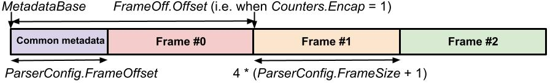

The XDP2 Parser
================

The XDP2 Parser is a framework and API for programming high performance
protocol parsers.  Protocol parsing is a fundamental operation in network
processing and is best programmed via a declarative representation instead of
a traditional imperative representation as a sequence of instructions. In
XDP2, a parser is defined by a set of data structures and embedded functions
that instantiate a customizable parse graph for a particular use case. The
XDP2 Parser is supported in the XDP2 library that contains open APIs allowing
a developer to build customized parsers for a variety of arbitrary protocols.

A parser is programmed in a front end language against a parser API. A frontend
compiler compiles the parser program into an intermediate representation that
maintains the declarative structure of the parse graph. Backend compilers for
different targets compile the Intermediate Representation to executable images.
A backend compiler is target specific and can leverage target specific features
to optimize parsing (both software and hardware optimizations).

The first language supported by the XDP2 Parser is C, so a library and C API is
provided as part of the XDP2 API. The current targets are plain C with a
parsing engine in a library, an optimized parser in C where the parse loop
is unrolled in an imperative program, and an eBPF target that uses a similar
technique to output the parser in imperative C code that compiles to eBPF.

Design
======

A key observation concerning protocol parsing is that it is best modeled as a
declarative structure as opposed to an imperative program. The XDP2 Parser
employs such a structure as a parse graph where each node describes a protocol
and includes the attributes and operations for processing that protocol. The
manifestation of a *parse graph* in the XDP2 Parser is a well defined tree
data structure in C or C++. When a packet, or more generally Protocol Data Unit
(PDU) or data object, is processed the parser engine is invoked to "walk the
parse graph". The nodes of the parse graph include callout functions for
custom, per protocol processing. An efficient software implementation can be
elicited by an optimizing compiler that is aware of the XDP2 Parser data
structure, and the XDP2 Parser is amenable to hardware acceleration by mapping
data structures and operations to hardware mechanisms and functions. An example
of a protocol parse graph is shown below.


The fundamental data structures of the XDP2 parser are:
 * **Protocol definitions**
 * **Parse nodes**
 * **Protocol tables**
 * **Parsers**

The main header file for the XDP parser is
[include/xdp2/parser.h](../src/include/xdp2/parser.h). That header file includes
[include/xdp2/parser_types.h](../src/include/xdp2/parser_types.h) that contains
the core type and data structure definitions.

Protocol definitions
--------------------

A **protocol definition** provides the properties and functions needed to
parse one protocol to proceed to the next protocol in the parse graph for a
packet. A protocol definition contains common characteristics that reflect the
standard protocol definition (for instance, there is only one standard procedure
to determine the length of an IPv4 header).

The parse walk over a protocol requires two key pieces of information:

* The *protocol type* of the next node
* The *length* of the current protocol header

A protocol definition has two
corresponding functions that are implemented per a specific protocol:

* **len**: Returns the length of the current protocol layer (or protocol header)
* **next_proto**: Returns the protocol type of the next layer

The **struct xdp2_proto_def** data structure, defined in
[include/xdp2/parser_types.h](../src/include/xdp2/parser_types.h),
contains a protocol definition for one protocol.
Members include operations to get the length of the current header and to get the
protocol of the next header. A set of protocol definitions for common protocols
is in [include/xdp2/proto_defs](../src/include/xdp2/proto_defs).
The protocol nodes for common protocols are named **proto_NAME**, where
**NAME** is a protocol like IPv4, IPv6, TCP, UDP, etc. All common protocol
nodes can be defined by including
[include/xdp2/proto_nodes_def.h](../src/include/xdp2/proto_nodes_def.h).
Note when this header is included the various protocol nodes are defined as
**static const struct xdp2_proto_node** structures (i.e. these protocol node
definitions are not global but restricted to a compilation unit to
facilitate compiler optimizations).

Parse nodes
-----------

A **parse node** is an instantiation of one node in the parse graph of a parser
being defined. A parse node includes a reference to the protocol node for the
specific protocol, as well as customizable processing functions. A parse node
allows defining two optional custom processing functions:

* **extract_metadata**:  Extract metadata, e.g. protocol fields, from a
protocol header and save it in a metadata memory buffer

* **handle_proto** : Perform arbitrary protocol processing. This function might
implement the full logic of protocol processing of some protocol

The data structure for a parse node is **struct xdp2_parse_node** which
is defined in [include/xdp2/parser_types.h](../src/include/xdp2/parser_types.h).
Members include operations to extract metadata and perform per protocol
processing. A parse node references a protocol definition for the specific
protocol.

Protocol tables
---------------

A **protocol table** is a lookup table that takes a protocol number as input
and returns the parse node for the next layer. The protocol numbers can be
canonical protocol numbers, for instance a protocol number might be an IP
protocol number where the table contains parse nodes for various IP protocols
(e.g. for TCP, UDP, etc.). Non-leaf parse nodes have a reference to a
corresponding protocol table; for instance, a parse node for IPv6 would refer
to a protocol table that takes an IP protocol number as input and returns the
parse node for the corresponding IP protocol.

The **struct xdp2_proto_table** data structure, defined in
[include/xdp2/parser_types.h](../src/include/xdp2/parser_types.h), contains a
protocol table. A protocol table is composed of an array of type and parse
node pairs. The type of one entry in the table is **struct xdp2_proto_table**
which is defined as:
```C
struct xdp2_proto_table_entry {
        int value;
        const struct xdp2_parse_node *node;
};
```

<figure class="image">
    
    <figcaption> Logic flow for parsing nodes in a parse graph. For each node,
    first the header length is computed and checked against the minimum length
    in the protocol definition and the packet length. The extract_metadata and
    handle_proto functions of the parse graph are called. Next TLVs, flag
    fields, or an array are parsed if they are defined for the node. If the
    parse node is a leaf node then the parser exits, else then next protocol
    type is determined, a lookup on the parse node's protocol table is
    performed, and the parser proceeds to process the next node returned from
    the lookup
    </figcaption>
</figure>

Parsers
-------

A **parser** defines a parser and includes a set of parse nodes, each having a
reference to a protocol definition. Non-leaf parse nodes have a reference to a
protocol table. The parse nodes are connected to be a graph via the
relationships set in the protocol tables. The parser can be represented as a
declarative data structure in C and can equivalently be viewed as a type of
Finite State Machine (FSM) where each parse node is one state and transitions
are defined by a next protocol type and associated protocol tables. A parser
defines a **root node** which is the start node for parsing an object (for
networking the root is typically Ethernet).

The **struct xdp2_parser** data structure, defined in
[include/xdp2/parser_types.h](../src/include/xdp2/parser_types.h), defines an
instance of a parser.  The key member is the *root node* of the parser which
is the parse node at which parsing commences for a data object. Other members
include references to "okay", "fail" and "at encap" nodes. Parse configuration
is in the *config* member which has type **struct xdp2_parser_config**.

There are four special parse nodes associated with a parser:

* **root_node**
  The root node where parsing commences (typically Ethernet)

* **okay_node**
  A leaf parse node visited when the parser exits on success

* **fail_node**
  A leaf parse node visited when the parser exits on an error condition

* **at_encap**
  A leaf parse node visited when the parser encounters an encapsulation protocol.
Parsing continues with the next encapsulated node.

<figure class="image">
    
    <figcaption>Parse nodes and protocol tables for an example parser for TCP and UDP
    over IPv4 and IPv6 over Ethernet.
    </figcaption>
</figure>


Metadata
--------

Metadata is ancillary data concerning a data object that is collected as a
data object is parsed. Each protocol layer may write metadata corresponding to
its protocol. Typically, metadata is simply taken from fields in a packet that
are copied to fields in the metadata structure intended to hold the data for
the field in a protocol header.

A metadata frame contains the metadata corresponding to a set of protocol
layers for a logical group within processing. The canonical example of this
is encapsulation in networking, where a packet may have several layers of
encapsulation and for each encapsulation an associated set of metadata might
include IP addresses, protocols, and transport port numbers. Parser
configuration includes the maximum number of frames, frame size,
and number of encapsulations which serves as the index to the current metadata
frame. When an encapsulating protocol is encountered, as indicated by an
attribute of a protocol definition, the number of encapsulations is incremented
and subsequent metadata is written to the next frame. If the number of
encapsulations exceeds the maximum number of metadata frames, then the last
frame is used and data from the previous frame is overwritten. A common
configuration might be to employ two frames to get metadata for the outermost
headers and headers of the innermost encapsulation (the variables for parser
configuration are discussed below).

A metadata buffer is defined by the programmer. The first part of the buffer
is the *metameta data* that holds metadata common to all nodes. Following the
metameta data is an array of frames of the same length. The image below shows
an example metadata buffer with metameta data followed by three frames.



The structure of the metameta data and metadata frames is determined by the
program. Typically, they would hold fields for various items of metadata
extracted from packets as they are parsed.

Parsing TLVs
------------

*Type-Length-Value* tuples (*TLVs*) are a common networking protocol construct
that encodes variable length data in a list. Each datum contains a *Type* to
discriminate the type of data, a *Length* that gives the byte length of the
data, and a *Value* that is the bytes of data. TLVs are parsed in the context
of a top level protocol, for instance TCP options and IPv4 options are
represented by TLVs parsed in the context of a TCP header and IPv4 header
respectively.  The definitions for parsing TLVs are in 
[include/xdp2/tlvs.h](../src/include/xdp2/tlvs.h) which is included in
[include/xdp2/parser.h](../src/include/xdp2/parser.h).

<figure class="image">
    
    <figcaption> Logic flow for parsing a list of TLVs. data_off is the
    offset of the current TLV being processed and data_bound is the remaining
    length of the TLVs area that follows the start of the current TLV. If the
    data_bound is zero then all the TLVs are processed so TLVs processing
    completes. The length of the current TLV is computed. If it is greater than
    data_bound then the TLV length is bad so TLVs processing exits on an error.
    If the length is good then a lookup is performed on the TLV type. The lookup
    returns a TLV node that is visited to process the TLV. When TLV node
    processing completes, data_off and data_bnd are adjusted per the current
    TLV's length and the processing proceeds to the next TLV
    </figcaption>
</figure>

A **TLVs protocol definition**, with data structure
**struct xdp2_proto_tlvs_def** (note plural TLVs) is an extended protocol
definition that describes a protocol that includes TLVs. A TLVs protocol
definition provides the properties and functions to parse TLVs in the context
of a top level protocol and includes three TLV-specific operations:
**tlv_len**, **tlv_type**, and **tlv_data_offset**. The **tlv_len** function
returns the length of a TLV (and therefore the offset of the next TLV),
**tlv_type** returns the type of a TLV, and **tlv_data_offset** returns the
offset of the data within a TLV. Note that **tlv_len** returns the length of
the whole TLV including any TLV header, so the length of just the data in a TLV
is the total length of the TLV as given by **tlv_len** minus the offset of the
data as given by **tlv_data_offset**.

A **TLVs parse node**, with data structure **struct xdp2_parse_tlvs_node**,
(again note plural TLVs) is an extended parse node that has references to a
TLVs protocol definition and a TLVs table. The data structure also includes
a "wild card node" that is used when a TLV type isn't found in the table, and
settings for the maximum number of TLVs and TLV length.

A **TLV table**, with data structure **struct xdp2_proto_tlvs_table**, is a
lookup table that takes a TLV type as input and returns a TLV parse node for
a TLV.

A **TLV parse node**, with data structure **struct xdp2_parse_tlv_node**,
(note the singular TLV) describes the processing of one type of TLV. This
includes two optional operations: **extract_metadata**, and
**handle_tlv**. **extract_metadata** extracts specified data from the TLV to
the metadata structure, and **handle_tlv** performs arbitrary processing of
the TLV.

<figure class="image">
    
    <figcaption> Example nodes for parsing TLVs. On the left is a TLVs parse
    node for TCP. The TLVs parse node points to a protocol table that maps TLV
    type (kind in TCP) to a TLV node. In this example, the table maps the TCP
    Timestamp option and TCP Authentication option kinds to TLV nodes for
    processing the respective options.
    </figcaption>
</figure>

Parsing flag-fields
-------------------

*Flag-fields* are a common networking protocol construct that encodes optional
data in a set of flags and data fields. The flags indicate whether or not a
corresponding data field is present. The data fields are fixed length and
ordered by the ordering of the flags indicating the presence of the fields.
Examples of protocols employing flag-fields are GRE and GUE. The
definitions for parsing flag-fields are in
[include/xdp2/flag_fields.h](../src/include/xdp2/flag_fields.h) which is
included in [include/xdp2/parser.h](../src/include/xdp2/parser.h).

<figure class="image">
    
    <figcaption> Logic flow for parsing a set of flag-fields. data_off is the
    offset of the next field data_bound is the remaining length in the fields
    area that follows the start of the field. Processing starts by loading the
    flag.  The set of possible flags is contained in a descriptor table that
    includes a flag value and mask. The entries in the descriptor table are
    ordered by the flag values, The entries in the flags descriptor table are
    scanned and for each entry the flag value is compared against the loaded
    flags with the entry's mask applied. If they match then the flag is set in
    the flag-fields. Upon a match, the index of the entry in the descriptor
    table is used as a key for a lookup in a protocol table. The protocol table
    maps an index to a flag-field node. The returned node is visited to process
    the flag-field. When flag-field processing completes data_offset and
    data_bnd adjusted and processing loops to consider the next flag.
    Flag-fields processing complete when all flags in the descriptor table have
    been checked.
    </figcaption>
</figure>

The pertinent structures for flag-fields in the XDP2 parser are:

* **struct xdp2_flag_field**: describes the format of one flag-field. The
members of this structure include the **flag** bits, the **mask** to apply to a
set of flags, and a **size** which is the byte size of the corresponding field.
A flag-field is matched in a set of flags if
((*flags* & *fs->mask*) == *fs->flag*) where *fs* is a pointer to a flag-field
structure.

* **struct xdp2_flag_fields**: contains an array of flag-field structures
that describe the set of flag-fields for some protocol. This structure
is defined in the protocol definition of a flag-field. The entries in this
array are considered in order when processing flag-fields. When an entry
matches the index in the array is returned to the parser loop that can
then perform a lookup in a table that maps the flag-field index to a
flag-field node.

Functions to process and parse flag-fields are:

* **size_t xdp2_flag_fields_length(__u32 flags, const struct xdp2_flag_fields
\*flag_fields)**

  Return the length of all the fields for some set of **flags**. This function
  is commonly used to determine the variable length of a protocol header that
  contains flag-fields.

* **ssize_t xdp2_flag_fields_offset(__u32 targ_idx, __u32 flags, const struct
xdp2_flag_fields \*flag_fields)**

  Returns data field offset for a flag as determined by the flags set in
  **flags**. **idx** identifies the flag being tested as an index into the
  table in **flag_fields**.

* **__uN xdp2_flag_fields_getN(const __u8 \*fields, __u32 targ_idx,
__u32 flags, const struct xdp2_flag_fields \*flag_fields)**

  Function to get the value of the data field for some flag. **N** indicates
  the return type in a number of bits and can be 8, 16, 32, or 64. **fields**
  is a pointer to the fields data in the object, **targ_idx** refers to the
  flag being queried and is an index in the **flag_fields table**. **flags**
  are the flags from the object being parsed.

<figure class="image">
    
    <figcaption> Flag-field nodes for parsing GRE flag-fields. On the left
    is the flag-fields descriptor table that gives a value, mask, and field size
    for each possible flag. GREv0 is a flag-fields parse node, it has a
    reference to the descriptor table and a protocol table. The protocol table
    has set entries for a GRE Key ID flag and Sequence Number.
    </figcaption>
</figure>

Parsing arrays
--------------

*Arrays* are a common networking protocol construct that encodes optional
data in an array. All elements of an array are the same size. An example
protocol containing an array is SRv6 (Segment Routing Header) which includes
an array of segments. The definitions for parsing arrays are in
[include/xdp2/arrays.h](../src/include/xdp2/arrays.h) which is
included in [include/xdp2/parser.h](../src/include/xdp2/parser.h).

A protocol definition with type **struct xdp2_proto_array_def** defines
a protocol definition with an array. There are three array related operations:
**el_type** takes a pointer to an array element and returns its type,
**num_els** takes a pointer to a top level header and returns the number of
elements in the array, and **start_offset** takes a pointer the top level
header and returns the offset of the array. The constant size of an array
element is given by the **el_length** field.

A parse node of type **struct xdp2_parse_array_node** is an extended
parse node with an array. The structure includes **max_els** that gives the
maximum allowed number of elements in the array. An array parse node points
to a protocol definition of type **struct xdp2_proto_array_def**. The array
parse node includes a protocol table for looking up the parse node given for
the type of an element.

To parse an array, first the number of elements is computed by calling the
**num_els** operations. The elements of an array are then parsed via
a *for loop* over the array. For each element the protocol type is determined
by the **el_type** function. A lookup is performed and the returned
node is processed. If no match is found in the table, or the table is
NULL which might be true if there is no type associated with a table element
and all array elements are processed the same way, then the wildcard node in
the array parse node is invoked.

<figure class="image">
    
    <figcaption> Array parse nodes parsing SRv6 segment list in an array. On
    the left is an array parse node for SRv6. The SRv6 header is an
    IPv6 extension header so the next protocol table is set to the IP
    protocol table. The array table is set to NULL and the array wildcard
    node is set to an array element (arrel) node that processes the
    IPv6 address in each segment of the array.
    </figcaption>
</figure>

Parser API
==========

The XDP2 parser API consists of a number of helper macros to create a parser
and its corresponding data structures that instantiate the parser. The examples
provided in this section are taken from
[test/parse_dump/parser.c](../src/test/parse_dump/parser.c).

XDP2_PARSER
-----------

The **XDP2_PARSER** macro creates a parser as **struct xdp2_parser**.

```C
XDP_PARSER(PARSER, NAME, ROOT_NODE, CONFIG)

/* Define parser as static */
XDP2_PARSER_STATIC(PARSER, NAME, ROOT_NODE, CONFIG)

/* Define optimized parser (compiler optimized) */
XDP2_PARSER_OPT(PARSER, NAME, ROOT_NODE, FUNC, CONFIG)

/* Define a parser for XDP */
XDP2_PARSER_XDP(PARSER, NAME, ROOT_NODE, FUNC, CONFIG)

/* External and static forward declarations */
XDP2_PARSER_EXTERN(NAME) /* Make an extern declaration */
XDP2_PARSER_STATIC_DECL(NAME) /* Make a static definition */
```

The macro arguments include the name of the parser structure (**PARSER**), a
text name of the parser for debugging (**NAME**), and the root node
(**ROOT_NODE**) that is a pointer to a **struct xdp2_parse_node**. **CONFIG**
allows configuration parameters to be set (see below for examples). There are
a few variants of the macro for creating parsers in a specific use context.

Parser configuration parameters:

| Config parameter | Description |
|---|---|
| okay_node | Parse node to visit when parser completes without error |
| fail_node | Parse node to visit when parser exits error |
| atencap_node | Parse node to visit when parser encounters and encapsulation protocol |
| max_nodes | Maximum number of nodes that may be visited |
| max_encaps | Maximum number of encapsulation layers |
| max_frames | Maximum number of metadata frames |
| metameta_size | Size of the metameta data |
| frame_size | Size of one metadata frame |
| num_counters | Number of parser counters |
| num_keys | Number of parser keys |

In the example below the **parse_dump** parser is defined with **ether_node_root** as
the root node. Several configuration parameters are set including the "okay", "fail",
and "atencap" nodes; and also configuration for the metadata is specified.
```C
XDP2_PARSER(parse_dump, "Parser to dump protocols", ether_node_root,
            (.okay_node = &okay_node.pn,
	     .fail_node = &fail_node.pn,
             .atencap_node = &atencap_node.pn,
             .max_frames = METADATA_FRAME_COUNT,
             .metameta_size = sizeof(struct metametadata),
             .frame_size = sizeof(struct metadata),
             .num_counters = 3, .config.num_keys = 3
	    )
)
```

XDP2_MAKE_PARSE_NODE
--------------------
Creates a non-leaf parse node as a **static const struct xdp2_parse_node**.
A non-leaf parse node includes a protocol table to transition to the next
parse node.

```C
XDP2_MAKE_PARSE_NODE(PARSE_NODE, PROTO_DEF, PROTO_TABLE, EXTRA)
```

The arguments to the macro include the name of the parse node (**NAME**), the
corresponding protocol definition (**PROTO_DEF**), a protocol table for
transitioning to the next node in the parse walk (**PROTO_TABLE**). **EXTRA**
contains other configuration parameters and attributes.

The attributes that may be set in **EXTRA** include:

| Attributes | Description |
|---|---|
| ops.extract_metadata | Pointer to a function to extract metadata |
| ops.handler | Pointer to a function to perform protocol processing |
| ops.post_handler | Pointer to a function to perform protocol processing after TLVs, flag-fields, or array processing |
| unknown_ret | Error code to set when an unknown protocol is encountered |

The example below creates a typical Ethernet node for the root of a parser.
The name is **ether_node_root**. The protocol definition is
**xdp2_parse_ether** which is defined in
[include/xdp2/proto_defs/proto_ether.h](../src/include/xdp2/proto_defs/proto_ether.h).
The protocol table is **ether_table** and the definition is shown below.
An extract metadata function and a handler function are specified.

```C
XDP2_MAKE_PARSE_NODE(ether_node_root, xdp2_parse_ether, ether_table,
                     (.ops.extract_metadata = extract_ether,
                      .ops.handler = handler_ether_root));
```

XDP2_MAKE_AUTONEXT_PARSE_NODE
-----------------------------

Create an "auto next" parse node. The next node is explicitly provided in
**NEXT_NODE** and the rest of the arguments are the same as for
**XDP2_MAKE_PARSE_NODE**.
```C
XDP2_MAKE_AUTONEXT_PARSE_NODE(PARSE_NODE, PROTO_DEF, NEXT_NODE, EXTRA)
```
Here is an example use:
```C
XDP2_MAKE_AUTONEXT_PARSE_NODE(vxlan_node, xdp2_parse_vxlan, ether_node,
                              (.ops.handler = handler_vxlan));
```

XDP2_MAKE_LEAF_PARSE_NODE
-------------------------

Creates a leaf parser node where there is no next protocol and no protocol
table associated with the parse node. The semantics of the arguments
are the same as the similarly named ones of **XDP2_MAKE_PARSE_NODE**.

```C
XDP2_MAKE_LEAF_PARSE_NODE(PARSE_NODE, PROTO_DEF, EXTRA)
```
The example below creates a non-leaf parse node for ICMPv4.

```C
XDP2_MAKE_LEAF_PARSE_NODE(icmpv4_node, xdp2_parse_icmpv4,
                          (.ops.extract_metadata = extract_icmpv4,
                           .ops.handler = handler_icmpv4,
                           .unknown_ret = XDP2_STOP_OKAY));
```

XDP2_MAKE_PROTO_TABLE
---------------------

Creates a protocol table containing a variable list of entries as a **static
const struct xdp2_proto_table**. The arguments consist of the name of the
table (**NAME**) and a variable list of pairs in the form
{ *NUMBER, PARSE_NODE* }.
```C
XDP2_MAKE_PROTO_TABLE(NAME, ...)
```

Example protocol table for Ethernet:
```C
XDP2_MAKE_PROTO_TABLE(ether_table,
        ( __cpu_to_be16(ETH_P_IP), ip_overlay_node ),
        ( __cpu_to_be16(ETH_P_IPV6), ip_overlay_node ),
        ( __cpu_to_be16(ETH_P_PPP_SES), pppoe_node ),
        ( __cpu_to_be16(0x880b), ppp_node ),
        ( __cpu_to_be16(ETH_P_8021AD), e8021AD_node ),
        ( __cpu_to_be16(ETH_P_8021Q), e8021Q_node ),
        ( __cpu_to_be16(ETH_P_ARP), arp_node ),
        ( __cpu_to_be16(ETH_P_TEB), ether_node )
);
```

Parsing TLVs API
---------------

The API for parsing TLVs is similar to that of parsing plain protocols. A
set of macros is defined tlvs.h.

### XDP2_MAKE_TLVS_PARSE_NODE

Creates a non-leaf parse node for a protocol with TLVs as a
**static const struct xdp2_parse_tlvs_node**. Macro arguments include both
those for generic parse nodes and TLV-specific arguments.

```C
XDP2_MAKE_TLVS_PARSE_NODE(PARSE_TLVS_NODE, PROTO_TLVS_DEF, PROTO_TABLE,
			  TLV_TABLE, EXTRA_PN, EXTRA_TLVS)
```

The arguments to the macro include the name of the parse node
(**PARSE_TLVS_NODE**), the corresponding TLVs protocol definition
(**PROTO_TLVS_DEF**), and a canonical protocol table for transitioning to the
next node in the parse walk (**PROTO_TABLE**). A protocol table to
lookup a TLV parse node from a TLV type is given by **TLV_TABLE**. 
**EXTRA_PN** contains other configuration parameters and attributes for
generic parse nodes like described above, and **EXTRA_TLVS** contains other
TLV-specific configuration parameters and attributes.
 
The attributes that may be set in **EXTRA_TLVS** include:

| Attributes | Description |
|---|---|
| max_tlvs | Limit on number of TLVs to parse |
| max_tvl_len | Maximum allowed length of one TLV |
| unknown_tlv_type_ret | Error code to set when an unknown TLV type is encountered |
| tlv_wildcard_node | Wildcard node to visit if TLV type is not found in lookup |

Below is an example for creating a TLVs parse node.

```C
XDP2_MAKE_TLVS_PARSE_NODE(geneve_v0_node, xdp2_parse_geneve_v0,
                          ether_table, geneve_class_table,
                          (.ops.handler = handler_geneve_v0), ());
```

### XDP2_MAKE_TLVS_AUTONEXT_PARSE_NODE

Creates an autonext node for TLVs similar to **XDP2_MAKE_AUTONEXT_PARSE_NODE**.

```C
XDP2_MAKE_TLVS_AUTONEXT_PARSE_NODE(PARSE_TLV_NODE, PROTO_TLV_DEF,
				   NEXT_NODE, TLV_TABLE,
				   EXTRA_PM, EXTRA_TLVS)
```

### XDP2_MAKE_LEAF_TLVS_PARSE_NODE

Creates a leaf parse node for TLVs. The argument semantics are the same as
those in **XDP2_MAKE_TLVS_PARSE_NODE**.

```C
XDP2_MAKE_LEAF_TLVS_PARSE_NODE(PARSE_TLV_NODE, PROTO_TLV_DEF,
			       TLV_TABLE, EXTRA_PN, EXTRA_TLVS)
```

Here is an example of creating a TLVs parse node for TCP:

```C
XDP2_MAKE_LEAF_TLVS_PARSE_NODE(tcp_node, xdp2_parse_tcp_tlvs, tcp_tlv_table,
                               (.ops.extract_metadata = extract_tcp,
                                .ops.handler = handler_tcp),
                               (.tlv_wildcard_node = &tcp_opt_unknown_node));
```

### XDP2_MAKE_TLV_TABLE

Creates a TLV protocol table containing a variable list of entries as a
**static const struct xdp2_proto_tlvs_table**. The arguments consist of the
name of the table (**NAME**) and a variable list of pairs in the form
{ *NUMBER, TLV_PARSE_NODE* }.

```C
XDP2_MAKE_TLV_TABLE(NAME, ...)
```

Example TLV table for TCP:
```C
XDP2_MAKE_TLV_TABLE(tcp_tlv_table,
        ( TCPOPT_TIMESTAMP, tcp_opt_timestamp_node ),
        ( TCPOPT_SACK, tcp_opt_sack_node ),
        ( TCPOPT_MSS, tcp_opt_mss_node ),
        ( TCPOPT_WINDOW, tcp_opt_wscale_node ),
        ( TCPOPT_SACK_PERM, tcp_opt_sack_permitted_node )
);
```

### XDP2_MAKE_TLV_PARSE_NODE

Create a TLV parse node to parse one TLV of a particular type.

```C
XDP2_MAKE_TLV_PARSE_NODE(NODE_NAME, PROTO_TLV_DEF, EXTRA)
```
The attributes that may be set in **EXTRA** include:

| Attributes | Description |
|---|---|
| ops.extract_metadata | Pointer to a function to extract metadata from TLV |
| ops.handler | Pointer to a function to perform protocol processing of TLV |
| overlay_table | Allows processing of additional TLV nodes as an overlay |
| overlay_wildcard_node | Wildcard node for TLV over lookup (only valid if overlay_table iis non-NULL)
| unknown_overlay_ret | Error code to set when a type is not found in the overlay table |
| nested_node | If set process the TLV data as a nested protocol */

The arguments to the macro include the name of the TLV parse node
(**NODE_NAME**), the corresponding protocol definition for the TLV
(**PROTO_TLV_DEF**), and contains other configuration parameters and
attributes.

Here is an example for creating a TLV parse node for the TCP timestamp
option:

```C
XDP2_MAKE_TLV_PARSE_NODE(tcp_opt_timestamp_node,
                         xdp2_parse_tcp_option_timestamp,
                         (.tlv_ops.extract_metadata = extract_tcp_timestamp,
                          .tlv_ops.handler = handler_tcp_timestamp));
```

Parsing Flag-fields API
----------------------

The API for parsing flag-fields is similar to that of parsing plain protocols.
A set of macros is defined flag_fields.h.

### XDP2_MAKE_FLAG_FIELDS_PARSE_NODE

Creates a non-leaf parse node for a protocol with flag-fields as a
**static const struct xdp2_parse_flag_fields_node**. Macro arguments include
both those for generic parse nodes and flag-fields specific arguments.

```C
XDP2_MAKE_FLAG_FIELDS_PARSE_NODE(PARSE_FLAG_FIELDS_NODE,
				 PROTO_FLAG_FIELDS_DEF, PROTO_TABLE,
				 FLAG_FIELDS_TABLE, EXTRA_PN, EXTRA_FF)
```

The arguments to the macro include the name of the parse node
(**PARSE_FLAG_FIELDS_NODE**), the corresponding flag-fields protocol definition
(**PROTO_FLAG_FIELDS_DEF**), and a canonical protocol table for transitioning
to the next node in the parse walk (**PROTO_TABLE**). A protocol table to
lookup a flag-field parse node from an flag-field index (described above)
is given by **FLAG_FIELDS_TABLE**.  **EXTRA_PN** contains other configuration
parameters and attributes for generic parse nodes, and **EXTRA_FF** contains
other flag-field specific configuration parameters and attributes (currently
there are no interesting fields to set).

Below is an example for creating a flag-fields parse node.

```C
XDP2_MAKE_FLAG_FIELDS_PARSE_NODE(gre_v0_node, xdp2_parse_gre_v0, gre_v0_table,
                                 gre_v0_flag_fields_table,
                                 (.ops.extract_metadata = extract_gre_v0,
                                  .ops.handler = handler_grev0), ());
```

### XDP2_MAKE_FLAG_FIELDS_AUTONEXT_PARSE_NODE

Creates an autonext node for flag-fields similar to
**XDP2_MAKE_AUTONEXT_PARSE_NODE**.

```C
XDP2_MAKE_FLAG_FIELDS_AUTONEXT_PARSE_NODE(PARSE_FLAG_FIELDS_NODE,
					  PROTO_FLAG_FIELDS_DEF,
					  NEXT_NODE, FLAG_FIELDS_TABLE,
					  EXTRA_PN, EXTRA_FF)
```

### XDP2_MAKE_LEAF_FLAG_FIELDS_PARSE_NODE

Creates a leaf parse node for flag-fields. The argument semantics are the same
as those in **XDP2_MAKE_FLAG_FIELDS_PARSE_NODE**.

```C
XDP2_MAKE_LEAF_FLAG_FIELDS_PARSE_NODE(PARSE_FLAG_FIELDS_NODE,
				      PROTO_FLAG_FIELDS_DEF,
				      FLAG_FIELDS_TABLE,
				      EXTRA_PN, EXTRA_FF
```

### XDP2_MAKE_FLAG_FIELDS_TABLE

Creates a flag-field protocol table containing a variable list of entries as a
**static const struct xdp2_proto_flag_fields_table**. The arguments consist of
the name of the table (**NAME**) and a variable list of pairs in the form
{ *INDEX, FLAG_FIELD_PARSE_NODE* }. The *INDEX* is a flag-field index
returned by the flag-fields protocol definition.

```C
XDP2_MAKE_FLAG_FIELDS_TABLE(NAME, ...)
```

Here is an example creating a flag-fields table for GRE.

```C
XDP2_MAKE_FLAG_FIELDS_TABLE(gre_v0_flag_fields_table,
        ( GRE_FLAGS_CSUM_IDX, gre_flag_csum_node ),
        ( GRE_FLAGS_KEY_IDX, gre_flag_key_node ),
        ( GRE_FLAGS_SEQ_IDX, gre_flag_seq_node )
);
```

### XDP2_MAKE_FLAG_FIELD_PARSE_NODE

Create a flag-field  parse node to parse one flag-field of a particular type.

```C
XDP2_MAKE_FLAG_FIELD_PARSE_NODE(NODE_NAME, EXTRA)
```

The arguments to the macro include the name of the flag-field parse node
(**NODE_NAME**) and other configuration parameters and attributes in
**EXTRA**.

The attributes that may be set in **EXTRA** include:

| Attributes | Description |
|---|---|
| ops.extract_metadata | Pointer to a function to extract metadata from flag-field |
| ops.handler | Pointer to a function to perform protocol processing of flag-field |

Here is an example for parsing a GRE key flag-field.

```C
XDP2_MAKE_FLAG_FIELD_PARSE_NODE(gre_flag_key_node,
                                (.ops.extract_metadata =
                                                extract_gre_flag_key));
```
Parsing Arrays API
----------------------

The API for parsing arrays is similar to that of parsing plain protocols.
A set of macros is defined in arrays.h.

### XDP2_MAKE_ARRAY_PARSE_NODE

Creates a non-leaf parse node for a protocol with an array as a
**static const struct xdp2_parse_array_node**. Macro arguments include
both those for generic parse nodes and arrays specific arguments.

```C
XDP2_MAKE_ARRAY_PARSE_NODE(PARSE_ARRAY_NODE, PROTO_ARRAY_DEF,
			   PROTO_TABLE, ARRAY_TABLE, EXTRA_PN, EXTRA_ARRAY)
```

The arguments to the macro include the name of the parse node
(**PARSE_ARRAY_NODE**), the corresponding array protocol definition
(**PROTO_ARRAY_DEF**), and a canonical protocol table for transitioning
to the next node in the parse walk (**PROTO_TABLE**). A protocol table to
an array element type (**ARRAY_TABLE**). **EXTRA_PN** contains other
configuration parameters and attributes for generic parse nodes, and
**EXTRA_ARRAY** contains other array specific configuration parameters and
attributes.

The attributes that may be set in **EXTRA_ARRAY** include:

| Attributes | Description |
|---|---|
| max_els | Limit on number of element in an array |
| max_tvl_len | Maximum allowed length of one TLV |
| unknown_array_type_ret | Error code to set when an unknown array element type is encountered |
| array_wildcard_node | Wildcard node to visit if array type is not found in lookup |

**XDP2_MAKE_ARRAY_PARSE_NODE_NOTAB** is the same as
**XDP2_MAKE_ARRAY_PARSE_NODE** except that the **ARRAY_TABLE** argument is
missing. The processing for each element can be set using a wildcard node.

```C
XDP2_MAKE_ARRAY_PARSE_NODE_NOTAB(PARSE_ARRAY_NODE, PROTO_ARRAY_DEF,
				 PROTO_TABLE, EXTRA_PN, EXTRA_ARRAY)
```

Below is an example for creating an array parse node without an array table.

```C
XDP2_MAKE_ARRAY_PARSE_NODE_NOTAB(ipv6_srv6_routing_header_node,
				 xdp2_parse_srv6_seg_list, ip6_table,
				 (.ops.extract_metadata = extract_eh,
				  .ops.handler =
					handler_ipv6_srv6_routing_header,
				  .unknown_ret = XDP2_STOP_OKAY),
				 (.array_wildcard_node =
					XDP2_ARREL_NODE(ipv6_srv6_segment)));
```

### XDP2_MAKE_FLAG_FIELDS_AUTONEXT_PARSE_NODE

Creates an autonext node for arrays similar to
**XDP2_MAKE_AUTONEXT_PARSE_NODE**.

```C
XDP2_MAKE_ARRAY_AUTONEXT_PARSE_NODE(PARSE_ARRAY_NODE, PROTO_ARRAY_DEF,
				    NEXT_NODE, ARRAY_TABLE, EXTRA_PN,
				    EXTRA_ARRAY)
```

**XDP2_MAKE_ARRAY_AUTONEXT_PARSE_NODE_NOTAB** is the same as
**XDP2_MAKE_ARRAY_AUTONEXT_PARSE_NODE** except that the **ARRAY_TABLE**
argument is missing. The processing for each element can be set using a
wildcard node.

```C
XDP2_MAKE_ARRAY_AUTONEXT_PARSE_NODE_NOTAB(PARSE_ARRAY_NODE, PROTO_ARRAY_DEF,
					  NEXT_NODE, EXTRA_PN, EXTRA_ARRAY)
```

### XDP2_MAKE_LEAF_ARRAY_PARSE_NODE

Creates a leaf parse node for arrays. The argument semantics are the same
as those in **XDP2_MAKE_ARRAY_PARSE_NODE**.

```C
XDP2_MAKE_LEAF_ARRAY_PARSE_NODE(PARSE_ARRAY_NODE, PROTO_ARRAY_DEF,
				ARRAY_TABLE, EXTRA_PN, EXTRA_ARRAY)
```

**XDP2_MAKE_LEAF_ARRAY_PARSE_NODE_NOTAB** is the same as
**XDP2_MAKE_LEAF_ARRAY_PARSE_NODE** except that the **ARRAY_TABLE**
argument is missing. The processing for each element can be set using a
wildcard node.

```C
XDP2_MAKE_LEAF_ARRAY_PARSE_NODE_NOTAB(PARSE_ARRAY_NODE, PROTO_ARRAY_DEF,
				      EXTRA_PN, EXTRA_ARRAY)
```

### XDP2_MAKE_ARRAY_TABLE

Creates an array protocol table containing a variable list of entries as a
**static const struct xdp2_proto_array_table**. The arguments consist of
the name of the table (**NAME**) and a variable list of pairs in the form
{ *KEY, ARREL_PARSE_NODE* }.

```C
XDP2_MAKE_ARRAY_TABLE(NAME, ...)
```

### XDP2_MAKE_ARREL_PARSE_NODE

Create an array element parse node to parse one array element of a particular
type.

```C
XDP2_MAKE_ARREL_PARSE_NODE(NODE_NAME, EXTRA)
```

The arguments to the macro include the name of the array element parse node
(**NODE_NAME**) and other configuration parameters and attributes in
**EXTRA**.

The attributes that may be set in **EXTRA** include:

| Attributes | Description |
|---|---|
| ops.extract_metadata | Pointer to a function to extract metadata from flag-field |
| ops.handler | Pointer to a function to perform protocol processing of flag-field |

Invoking the XDP2 Parser
========================

Return codes
------------

Various XDP2 related functions return a XDP2 return code. The current return
codes are:

* **XDP2_OKAY**
* **XDP2_STOP_OKAY**
* **XDP2_STOP_FAIL**
* **XDP2_STOP_LENGTH**
* **XDP2_STOP_UNKNOWN_PROTO**
* **XDP2_STOP_ENCAP_DEPTH**
* **XDP2_STOP_UNKNOWN_TLV**
* **XDP2_STOP_TLV_LENGTH**
* **XDP2_STOP_BAD_FLAG**

**XDP2_OKAY** indicates that the operation succeeded and that parsing may
continue. **XDP2_STOP_OKAY** indicates that parsing stopped normally without
an error. The other error codes, prefixed by **XDP2_STOP_**, indicate that
an error was encountered and parsing stopped or should stop.

Packet data structure
---------------------

Input packets to the parser are represented by a **struct xdp2_packet_data**
structure. This is defined as:

```C
struct xdp2_packet_data {
	void *packet;		/* Packet handle */
	size_t pkt_len;		/* Full length of packet */
	void *hdrs;		/* Pointer to header bytes */
	size_t hdrs_len;	/* Number of header bytes for parsing */
	__u32 seqno;		/* Sequence number per interface */
	__u32 timestamp;	/* Received timestamp */
	__u32 in_port;		/* Received port number */
	__u32 vrf_id;		/* Interface ID */
	__u16 pkt_csum;		/* Checksum over packet */
	__u16 flags;		/* Flags */
	void *arg;		/* Caller argument */
};
```

For just parsing a packet the most critical fields are *hdrs* and *hdr_len*.
The other fields are passed to handler functions in ancillary data.

Control data
------------

The extract metadata and protocol handler callback functions take a control
data argument. This is the structure **xdp2_ctrl_data** defined as:

```C
struct xdp2_ctrl_data {
        struct xdp2_packet_data pkt;
        struct xdp2_hdr_data hdr;
        struct xdp2_var_data var;
};
```

The **struct xdp2_hdr_data** contains information about the specific
header being processed:

```C
struct xdp2_hdr_data {
        size_t hdr_len;         /* Header length */
        size_t hdr_offset;      /* Header offset from beginning of packet */
        __u8 encaps;            /* Number of encapsulations */
        __u8 tlv_levels;        /* Num. TVL levels (used with nested TLVs) */
        __u16 pkt_csum;         /* Packet checksum to header start */
        __u16 hdr_csum;         /* Checksum of current header */
};
```

The **struct xdp2_var_data** returns variable data that may be set by
the handler functions. The structure is defined as:

```C
struct xdp2_var_data {
        void *metadata;         /* Pointer to metadata structure */
        int ret_code;           /* Return code */
        const struct xdp2_parse_node *last_node; /* Last node parsed */
        __u8 *counters;         /* Array of 8-bit counters */
        __u32 *keys;            /* Array of keys for passing between nodes */
};
```

For examples of using parser counters and keys see
[test/parse_dump/parser.c](../src/test/parse_dump/parser.c).

Invoking a parser
-----------------

A defined parser is invoked in code by:

```C
static inline int xdp2_parse(const struct xdp2_parser *parser,
                             const struct xdp2_packet_data *pdata,
                             void *metadata, unsigned int flags)
```

where **parser** is the parser to use, i.e. a parser created by XDP2_PARSER.
**pdata** is a pointer to a **struct xdp2_packet_data** structure with values
filled in by the caller. **metadata** is a pointer to a metadata buffer for
the parser (normally this would be zeroed). **flags** provides a set of flags
to affect parsing. Currently, one flag is defined **XDP2_F_DEBUG** that
enables parser debugging.

When the parser is invoked, a parse walk commences from the root node
following the parse graph. As parse nodes are visited, associated metadata
extraction functions and handler functions are called. The function returns
when the parse processes a leaf parse node or an error condition that caused
the parser to abort. An XDP2 return code is returned by the function.

Extract metadata functions
--------------------------

A user supplied extract metadata function may be attached to a parse node
(plain parse node, TLV parse node, or flag-field parse node). The
function should only write values to the metadata structure. The input
to the function is a pointer to the current header, a pointer to the
current metadata frame, and control data.

```C
void (*extract_metadata)(const void *hdr, void *frame,
			 const struct xdp2_ctrl_data ctrl);
```

An example extract metadata function is:

```C
static void extract_ports(const void *hdr, void *_frame,
                          const struct xdp2_ctrl_data ctrl)
{
        struct metadata *frame = _frame;
        const __be16 *ports = hdr;

        frame->port_pair.sport = ports[0];
        frame->port_pair.dport = ports[1];
}
```

Handler functions
-----------------

A user supplied handler function may be attached to a parse node
(plain parse node, TLV parse node, or flag-field parse node). The
function can perform protocol processing on the current header.
The input to the function is a pointer to the current header, a pointer to
the current metadata frame, and control data.

```C
int (*handler)(const void *hdr, void *frame,
                       const struct xdp2_ctrl_data ctrl);
int (*post_handler)(const void *hdr, void *frame,
		    const struct xdp2_ctrl_data ctrl);
```

The **handler** function is called before TLVs, flag-fields, or array
processing and the **post_handler** function is called after TLV or flag-fields
processing.

An example handler is:

```C
static int handler_ether_root(const void *hdr, void *frame,
                              const struct xdp2_ctrl_data ctrl)
{
        struct one_packet *pdata = ctrl.pkt.arg;

        if (verbose >= 5) {
                /* Print banner for the packet instance */
                LOC_PRINTFC(ctrl,
                        "------------------------------------\n");
                if (pdata)
                        LOC_PRINTFC(ctrl, "File %s, packet #%u\n",
                                    pdata->pcap_file, pdata->file_number);
                LOC_PRINTFC(ctrl, "Nodes:\n");
                LOC_PRINTFC(ctrl, "\tEther node\n");
        }

        return 0;
}
```
