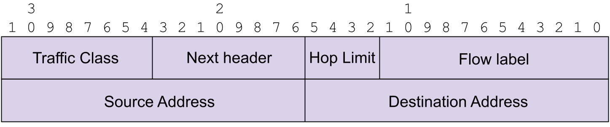

Scale Up Network Header
=======================

This document describes the implementation of the Scale Up Nwtwork Header
(SUNH).

Current support
===============

The features currently supported are:

* Standard include files with header formats and constant definitions for
  SUNH
* Packet tools to make a variety SUNH of protocol format
  samples in .pcap fiels
* Support in **parse_dump** to parse SUNH packets

Packet formats
==============

The Packet format structure for SUNH is in
[include/sunh/sunh.h](../../src/include/sunh/sunh.h).

Conformance
-----------

The packet format covers that described in
[Scale-Up Network Header (SUNH)](https:https://www.ietf.org/archive/id/draft-herbert-sunh-00.txt)



EtherType
---------

SUNH expects it own EtherType value. For the time being we use 0x805B that is
a reserved number for experimentation.

parse_dump
==========

Parse dump support is added via
[include/sunh/parser_test.h](../../src/include/sunh/parser_test.h).
That file creates all the parse nodes for PDS and SES. The entry point
into UET parsing is **uet_base**, that is set as the target node for the
UET UDP port number in the main UDP parse_dump protocol table (in
[parser.c](../../src/test/parse_dump/parser.c)).

pcap samples
============

.pcap files with samples of SUNH packets are built from tools in
[tools/packets/sunh](../../src/tools/packets/sunh). One .pcap files
is created, **sunh.pcap**, that contains sample packets with the SUNH header.

Running parse_dump
==================

**parse_dump** can be run with the .pcap files from the SUNH packets tool
[directory](../../src/tools/packets/unh).
From src/test/parse_dump we can parse SUNH packets:
```
$ ./parse_dump -c 1 -v 10 -U ../../tools/packets/sunh/sunh.pcap
------------------------------------
File ../../tools/packets/sunh/sunh.pcap, packet #0
Nodes:
	Ether node
	SNUH
		Source address: 4660 (0x1234)
		Destination address: 17185 (0x4321)
		Next header: 17 (0x11)
		Traffic class: 35 (0x23)
			DiffServ: 4 (0x4), ECN: 3 (0x3)
		Hop limit 14 (0xe)
		Flow label 3294 (0xcde)
	UDP node
	** Okay node
Frame #0:
	Ethertype: 0x885b
	SUNH: 18'52:8675->67'33:80
	Hash 0x59721b9a
Summary:
	Return code: XDP2 stop okay
	Last node: udp_node
	Counters:
		Counter #0: 0
		Counter #1: 0
		Counter #2: 0
```

