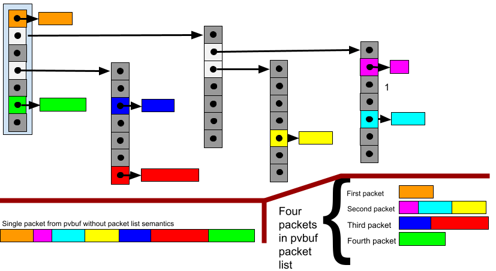

Packet IO vectors (PVbufs)
==========================

**Packet IO vector buffers**, or PVbufs, n XDP2 are data structures the hold
arbitrary packet data. A PVbuf is a structure than contains an array of iovecs,
and the iovecs support scatter/gather semantics. Each iovec is a **paddr** that
is a specialized memory address. There are a few different types of paddrs to
address different object types. One paddr type holds the address of a PVbuf.
An iovec in a PVbuf may be set to the paddr for another PVbuf thereby allowing
linked lists of PVbufs or PVbufs containing a hierarchy of PVbufs.

The API for PVbufs in in
[include/xdp2/pvbuf.h](../src/include/xdp2/pvbuf.h)

paddrs
======

A *paddr* is a specialized memory address. It's portable between different
address spaces. paddrs encode information about buffers (an address and data
length). They are concise sixty-four bit values that encode an paddr type, an
offset relative to a base address for the paddr type, and a data length of the
buffer (when set in an iovec). While the data length isn't technically part
of the address, it's convenient to encode it with an address

In the source code the type of a paddr is *xdp2_paddr_t*.

There are four paddr types. The type is indicated by the first two or four
bits of a paddr:

* PVbufs: first four bits are 0b0001
* Pbufs: first four bits are 0b0010 or 0b0011
* Short address: first two bits are 0b01xx, 0b10xx, or 0b11xx
* Long address: first four bits are 0b000

*sturct xdp2_paddr* is defined a as a union that contains the structures
of the  four paddr type:
```C
struct xdp2_paddr {
   union  {
	struct  { ...  } pvbuf;
	struct  { ...  } pbuf;
	struct  { ...  } short_addr;
	struct  { ...  } long_addr;
	xdp2_paddr_t paddr;
    };
};
```

PVBUFs
======

*Packet IO vectors*, or *pvbufs*, are meta structures that contain an iovec of
pbufs that comprise a packet or data object using scatter/gather techniques.
A pvbuf is a data structure that contains an array of IO vectors (iovecs).
Each IO vector contains a paddr that addresses a memory object or another
PVbuf, as well as a byte length of data in the object. 

The paddr for a PVbuf has the following structure:

* 4 bits paddr type (0b0001)
* 4 bits PVbuf size
* 24 bits index
* 32 bits data length
 
The paddr type of a PVbuf is 0b0001. PVbuf gives the size of the PVbuf
in number of cache-lines (64 bytes) minus one. The index is the index of
the object in the PVbuf allocator for the PVbuf size. The PVbuf size and
the index uniquely identify a PVBuf. The data length is the aggregate
length of all the memory objects within the PVbuf. If data length is set
to zero this indicates no information about the length of the memory object
(for instance, if the aggregate length of all the memory objects exceeds
4GB then the length would be set to zero).

This format allows up to 16,777,216 pvbufs to be defined per each PVbuf size.
The minimum length PVbuf is 64 bytes (seven iovecs taking the bitmap into
account) and the maximum is 1024 bytes or 255 iovecs (although the maximum
number of iovecs allowed by the bitmap is sixty-four).

An example diagram of a pvbuf is show below including two interpretations
of how the data would be logically linearized



iovec bitmap
------------

The first eight bytes of a PVBuf are a bitmap for the iovecs. If a bit is
set then the iovec corresponding to the index of the set bit is non-NULL,
and if a bit is not set then the corresponding iovec is NULL. The bitmap
facilitates a fast scan of non-NULL iovecs, and provides for efficient
initialization of the PVbuf by just zero'ing the bitmap. Note that the
bitmap effectively caps the number of iovecs in a single bitmap to be
sixty-four entries.


pvbufs within pvbufs
--------------------

The address of an iovec in a pvbuf may itself be that of another pvbuf. The
semantics are that the embedded pvbuf is expanded per the lovec when the
object represented by the pvbuf is logically linearized (see the example
diagram above). These embedded pvbufs may themselves contain pvbuf pointers
to create iovec hierarchies of arbitrary depth (although in practice, an
implementation will most likely want to limit the depth for performance). If
an iovec contains a pvbuf pointer, the corresponding length field in the iovec
may be zero or non-zero. If the length is zero then this indicates no
information about the length of the data in the pvbuf (in particular, the
aggregate length of data in the pvbuf is likely to be non-zero).  If the
length field is non-zero, then this must be equal to the sum of all the
lengths of iovecs in the pvbuf including the lengths of iovecs with pbuf
pointers that are in the iovec hierarchy of a pvbuf. Note that the maximum
length reported for a pvbuf in an iovec is 4,294,967,296 bytes, if the
length of a pvbuf is greater than this then the length field must be set to
zero which indicates no length is reported.

pvbufs as packet lists
----------------------

pvbufs can contain a list of packets by employing a one level depth hierarchy
of pvbufs within pvbufs. In this use case, each top level iovec in a pvbuf
would correspond to one packet. The top level iovec for a packet could contain
a pvbuf which describes the packet with its own iovec. Packet list pvbufs can
be linked via the last iovec in a pvbuf pointing another iovec of packets A
pvbuf does not contain any indication that it contains a packet list, this
semantic is an external characteristic that can be indicated in the use of the
pvbuf or a functional interface. A use case for packet lists is the
segmentation accelerator described below. The diagram above shows an example
of pvbufs within pvbufs, and how a packet would be linearized if the pvbuf is
not a packet list, and how there would be four packets linearized in the case
the pvbuf is a packet list.

Packet head structures
----------------------
Unlike skbufs and mbufs, pvbufs contain no ancillary control information.
For instance, there is no packet length, data pointer, or immediate data
normally associated with packet buffer structures. The logic of this design
is that such ancillary data is only needed when the packet or object is placed
on a non-work conserving queue. In other words, as a packets is being
processed any ancillary information can be passed as arguments or
in work item structures. The advantage of this scheme is that pvbufs are
very lightweight, minimize the memory accesses needed to load meta buffer
structures, and should be amenable to efficient hardware implementation.

In those cases where a pvbuf needs to be put on a non-work conserving queue,
a use case specific packet head structure can be allocated. As an example,
consider that a packet represented by a pvbuf needs to be queued in a queuing
discipline of an egress interface. The packet head structure would contain a
pointer to a pvbuf or paddr for a memory object information such as the full
packet length, next packet in the queue, time to send, and possibly a set of
control flags. 

```C
  struct egress_queue_packet {
      struct egress_queue_packet *next_packet;
      bool use_pvbuf;
      union {
          struct xdp2_pvbuf *pvbuf;
          xdp2_pbuf_addr_t pbuf;
      };
    
      __u16 flags;
      __u32 len;
  };
```

Another example of a packet head structure would be needed in a reassembly
accelerator (e.g. IP or TCP reassembly). In, this case a packet head structure
might include pointers to the next and previous packets in the reassembly
chain as well as sequence numbers of fragment numbers for matching packets to
a flow.

pbufs
=====

*Packet buffers*, or *pbufs*, are memory buffers in memory that hold any sort
of packet or object data. Packet buffers are allocated from contiguous address
blocks that are managed by the pvbuf library functions. Packet buffers may be
allocated in sizes of 2**N where N is in the range 6 to 20 inclusive, so
possible byte sizes for objects are 64, 128, 256, 512, 1024, 2048, 4096, 8192,
16384, 32768, 65536, 129,072, 258,144, 516,288, and 1,032,576 bytes. Each size
is managed as a memory pool in an object allocator. The XDP2 library exposes
interfaces to allocate and free pbufs (see below). A system is free to divide
memory up into objects of different sizes as needed

pbufs are primarily referenced by a forty-four bit pbuf address (the
forty-four bit encoding is used in the iovec address field of pvbufs as shown
below). A pbuf paddr address has the following structure:

* 4 bits paddr type (0b0010)
* 4 bits buffer tag
* pbuf index: 36-N
* pbuf offset: N bits

To indicate the address is for a pbuf, the paddr type is set to 0b0010. The
four bit buffer tag indicates the object size of the pbuf referred to by the
address. The object size is 2^N where N=buffer_tag + 6 and buffer_tag is a
number between 0 and 14 inclusive. The semantics of buffer tag 15 are described
below. The pbuf index identifies a pbuf; this is the index into the array of
pbufs for a particular size managed by an object allocator. The combination of
the buffer tag and pbuf index uniquely identify a pbuf. The pbuf offset is a
byte offset in the referenced pbuf; this allows addressing specific bytes in a
pbuf.

Buffer tag 15 is mostly a synonym for buffer tag 14. When buffer tag 15 is
used in an address of a pbuf in an iovec and length field of the iovec is one
less than the real length. This allows a length of 1,032,576 bytes to be
encoded. Other than this interpretation of the length field in an iovec there
is no semantic difference between the buffer tags 14 and 15. This scheme
allows setting a pbuf with a length of exactly one megabyte in an iovec (see
iovec discussion below).

Allocated pbuf objects are aligned to their size, for instance for an object
with a size of 4096 bytes:

     address_of_4K_pvbuf & 0xfff == 0.

This facilitates converting an address into a packet buffer to its base
address with no offset by:

    base_pbuf_address = pbuf_address & ~(2^N-1)
		where N is the buffer tag value plus six of the buffer tag
		in the pbuf address

The table below shows the mapping of a buffer tag in pbuf to the size of pbuf and the maximum number of pbufs for the given size:

| Buffer tag value  | N (tag+6) | Allocation size (2^N) | Max # pbuf (2^(20-N) |
|-------------------|-----------|-----------------|-----------------|
| 0                 | 6         | 64              | 1,073,741,824   |
| 1                 | 7         | 128             | 536,870,912     |
| 2                 | 8         | 256             | 268,435,456     |
| 3                 | 9         | 512             | 134,217,728     |
| 4                 | 10        | 1024            | 67,108,864      |
| 5                 | 11        | 2046            | 33,554,432      |
| 6                 | 12        | 4096            | 16,777,216      |
| 7                 | 13        | 8192            | 8,388,608       |
| 8                 | 14        | 16,384          | 4,194,304       |
| 9                 | 15        | 32,768          | 2,097,152       |
| 10                | 16        | 64,536          | 1,048,576       |
| 11                | 17        | 129,072         | 524,288         |
| 12                | 18        | 262,144         | 262,144         |
| 13                | 19        | 524,288         | 129,072         |
| 14                | 20        | 1,048,576       | 65,536          |


Reference counts
----------------
Reference counts are maintained for pbufs. When a pbuf is allocated its
reference count is set to one, and when a pbuf is freed then its reference
count is decremented. When a reference count goes to zero for a pbuf when its
freed then the data object for the pbuf is freed. A *pbuf get* operation is
called to take a reference for a pbuf.

Single reference pbufs
----------------------
A single reference pbuf is one that is known to only have on reference. Single
reference pbufs have paddr type 0b0011. When a single reference pbuf is
freed the reference count does not need to be checked so the free operation
is fast. A single reference pbuf is allocated as such when the caller intends
that there will be no more than one reference. If a single reference pbuf
is cloned then the paddr type is changed to a normal pbuf type and reference
counting becomes effective.

Short address paddrs
====================

A *short address paddr* is  base relative address that allows for three
memory regions each of which has its own base address. The paddr structure
for a short address is:

* 2 bits paddr type (0b01, 0b10, 0b11)
* 44 bits offset
* 18 bits data length

The three paddr types indicate the three memory regions each of which has
their own base address. The offset allows up to 16TBytes of memory to be
addressed per memory region. The memory regions can be pooled together to
allows 48TBytes of addressable memory. The data length is set to the real
data length minus one to allow up 262,144 bytes to be addressed. Note that
zero length cannot be represented in a short address.

Long address paddrs
===================

A *long address paddr* is a base relative address that includes a full 64-bit
offset and 32-bit length for addressing very large address spaces. Long
address paddrs are comprised of two 64-bit paddrs, a first and second
word. They consume two iovecs and must be in consecutive iovecs.

The first
word's structure is:

* 4 bits paddr type (0b0000)
* 1 one bit (always set to one)
* 1 word num (set to 0)
* 4 bits reserved
* 6 bits memory region
* 16 bits high offset
* 32 bits data length

The second words structure is:

* 4 bits paddr type (0b0000)
* 1 one bit (always set to one)
* 1 word num (set to 1)
* 10 bits reserved
* 48 bits low offset

The paddr type of a long address is 0b0000. In order to distinguish a long
address paddr from a NULL paddr the 5th bit of the paddr is set to one. The
sixth bit indicates the first or second word of a long address paddr. The
first word contains the memory region identifier that maps to a base address.
The first word also contains the sixteen high order bits of the offset
and the data length. The second word contains the low order forty-eight bits
of offset. The absolute address is computed by:

    address = memory_region_base[memory_region] + high_offset << 48 +
                                                              low_offset

Packet vector manager
=====================

The *packet vector manager*, or *PVmgr*, defines one instance of packet vector
memory. A PVmgr includes its own configuration and object allocators for
allocating and freeing PVbufs and pbuf (long and short addresses paddr
buffers are managed externally).

When an application runs there is a default PVmgre created. Alternatively,
an application may create its own PVmgr and may also define more than on
PVmgr for its own uses. Various service function described below take a
PVmgr structure as input. If the global PVmgr is used then the function
doesn't contain an explicit PVmgr argument, else the function includes a
PVmgr argument as *struct xdp2_pvbuf_mgr \*pvmgr*.

Operations
==========

The primary set of operations for bufs and pvbufs are:

 * Allocate and free pbufs
 * Allocate and free pvbufs
 * Pop headers
 * Prepend headers
 * Append trailers
 * Pop trailers
 * Push pbuf headers
 * Push pbuf trailers
 * Pullup headers
 * Pullup trailers

Allocate and free pbufs, and increment pbuf reference count
----------------------------------------------------------

Allocate a pbuf:
```C
xdp2_paddr_t xdp2_pbuf_alloc(size_t size, void **addr)
xdp2_paddr_t __xdp2_pbuf_alloc(struct xdp2_pvbuf_mgr *pvmgr,
			       size_t size, void **addr)
```
*size* is the requested size and *addr* is used to return an absolute
pointer to the pbuf.  A paddr  is returned or a NULL paddr upon allocation
failure. *size* is rounded up the next supported allocation size. Note that
the actual memory object for a pbuf is freed only when the reference count
for the pbuf goes to zero

Free a pbuf:

```C
  void xdp2_pbuf_free(xdp2_paddr_t paddr)
  void xdp2_pbuf_free(struct xdp2_pvbuf_mgr *pvmgr, xdp2_paddr_t paddr)
```

Note that there is no method to free a pbuf by pointer since the object
allocator is needed and that is encoded in a forty-eight bit pbuf address

Increment the reference count for a pbuf:

```C
  void xdp2_pbuf_bump_refcnt(xdp2_paddr_t paddr)
  void __xdp2_pbuf_bump_refcnt(struct xdp2_pvbuf_mgr *pvmgr,
			       xdp2_paddr_t paddr)
```

Allocate and free pvbufs
------------------------

Allocate a pvbuf and populate it with pbuf for some requested size:
```C
  struct xdp2_paddr_t xdp2_pvbuf_alloc(size_t size,
				       struct xdp2_pvbuf **pvbuf)
  struct xdp2_paddr_t __xdp2_pvbuf_alloc(struct xdp2_pvbuf_mgr *pvmgr,
					 size_t size,
					 struct xdp2_pvbuf **pvbuf)
```
*size* is the size of data in pbufs allocated for the pvbuf, *pvbuf*
is a absolute pointer to the allocated PVbuf.

Free a pvbuf including any pbufs and pvbufs under the pvbuf
```C
  void xdp2_pvbuf_free(xdp2_paddr_t paddr)
  void __xdp2_pvbuf_free(struct xdp2_pvbuf_mgr *pvmgr, xdp2_paddr_t paddr)
```

Pop headers from a pvbuf
------------------------
Pop some number of bytes of headers from the front of a pvbuf:
```C
size_t xdp2_pvbuf_pop_hdrs(xdp2_paddr_t paddr, size_t num_drop_bytes,
                           bool compress, void **copyptr)
size_t __xdp2_pvbuf_pop_hdrs(struct xdp2_pvbuf_mgr *pvmgr,
                              xdp2_paddr_t paddr, size_t num_drop_bytes,
                              bool compress, void **copyptr)
```
*pvbuf* is the input pvbuf, *num_drop_bytes* is the number of bytes to pop,
and *compress* indicates whether the pvbuf should be compressed after dropping
bytes. The return value is the number of bytes popped, it may be less than
*num_drop_bytes* if there length of data in *pvbuf* is less than
*num_drop_bytes*. *copyptr* is a pointer to a buffer to copy the popped data.
If it's NULL then no data copy is performed, else if *copyptr* is non-NULL then
the data that was popped is copied into \*copyptr, and the pointer value
plus the number of bytes copied is returned in copyptr.

Prepend headers in a pvbuf to a pvbuf
-------------------------------------
Prepend a pvbuf to another pvbuf:
```C
bool ___xdp2_pvbuf_prepend_pvbuf(struct xdp2_pvbuf_mgr *pvmgr,
                                 xdp2_paddr_t pvbuf_paddr,
                                 xdp2_paddr_t paddr,
                                 size_t length, bool compress);
bool xdp2_pvbuf_prepend_pvbuf(xdp2_paddr_t pvbuf_paddr,
                              xdp2_paddr_t paddr,
                              size_t length, bool compress);
```
*pvbuf_paddr* is the target pvbuf, *paddr* is the input pvbuf that will be
prepended to *pvbuf_paddr*, *length* is the length of data in *paddr* (the
*length* may be zero if the length of the data in the is unknown), and *compress*
indicates whether the pvbuf should be compressed after 
prepending the data. If the operation succeeds then true is returned
and *paddr* is considered to be consumed; if the operation failed
then false is returned and *paddr* is not consumed (i.e. the caller
needs to free it)

Pop trailers from a pvbuf
-------------------------
Pop some number of bytes of headers from the tail of a pvbuf:
```C
size_t xdp2_pvbuf_pop_trailers(xdp2_paddr_t paddr, size_t num_drop_bytes,
                               bool compress, void **copyptr);
size_t __xdp2_pvbuf_pop_trailers(struct xdp2_pvbuf_mgr *pvmgr,
                                 xdp2_paddr_t paddr, size_t num_drop_bytes,
                                 bool compress, void **copyptr);
```
*paddr* is the input pvbuf, *num_drop_bytes* is the number of bytes to pop,
and *compress* indicates whether the pvbuf should be compressed after dropping
bytes. copyptr is a pointer to a buffer to copy the popped data. If it's NULL
then no data copy is performed, else if copyptr is non-NULL then the data that
was popped is copied into *copyptr, and the pointer value plus the number of
bytes copied is returned in copyptr. The return value is the number of bytes
popped, it may be less than *num_drop_bytes* if there length of data in
*pvbuf* is less than *num_drop_bytes*

Append trailers in a pvbuf to a pvbuf
-------------------------------------

Append a pvbuf to another pvbuf:
```C
bool xdp2_pvbuf_append_pvbuf(xdp2_paddr_t pvbuf_paddr,
                             xdp2_paddr_t paddr,
                             size_t length, bool compress)
bool __xdp2_pvbuf_append_pvbuf(struct xdp2_pvbuf_mgr *pvmgr,
                               xdp2_paddr_t pvbuf_paddr,
                               xdp2_paddr_t paddr,
                               size_t length, bool compress)
```
*paddr* is the target pvbuf, *pvbuf_paddr* is the input pvbuf that will be
appended to *paddr*, *length* is the length of data in *paddr* (the
*length* may be zero if the length of the data in *pvbuf_trailers* is unknown),
and *compress* indicates whether the pvbuf should be compressed after 
appending the data. If the operation was successful then true is returned
and *paddr* is considered to be consumed; if the operation failed
then false is returned and pvbuf_trailers is not consumed (i.e. the caller
needs to free it)

Prepend a paddr to a pvbuf
-------------------------
Prepend a paddr to a pvbf:
```C
bool xdp2_pvbuf_prepend_paddr(xdp2_paddr_t pvbuf_paddr,
                              xdp2_paddr_t paddr_1,
                              xdp2_paddr_t paddr_2,
                              size_t length, bool compress)
bool __xdp2_pvbuf_prepend_paddr(struct xdp2_pvbuf_mgr *pvmgr,
                                xdp2_paddr_t pvbuf_paddr,
                                xdp2_paddr_t paddr_1,
                                xdp2_paddr_t paddr_2,
                                size_t length, bool compress)
```
*pvbuf_paddr* is the input pvbuf, *paddr_1* is the address of the object
being prepended, *length* is the length of the paddr (subject to the length
constraints of the paddr type). For a long address, *paddr_2* is the second
word. *compress* indicates whether the pvbuf should be compressed after
prepending the object. If the operation was successful then true is returned
and the pbuf referred to by *paddr_1* is considered to be consumed; if the
operation failed then false is returned and the pbuf referred to by *paddr_1*
is not consumed (i.e. the caller needs to free it)

Append a paddr to a pvbuf
------------------------
Append a paddr to a pvbuf:
```C
bool xdp2_pvbuf_append_paddr(struct xdp2_pvbuf_mgr *pvmgr,
                             xdp2_paddr_t pvbuf_paddr,
                             xdp2_paddr_t paddr_1,
                             xdp2_paddr_t paddr_2,
                             size_t length, bool compress)
bool __xdp2_pvbuf_append_paddr(struct xdp2_pvbuf_mgr *pvmgr,
                               xdp2_paddr_t pvbuf_paddr,
                               xdp2_paddr_t paddr_1,
                               xdp2_paddr_t paddr_2,
                               size_t length, bool compress)
```
*pvbuf_paddr* is the input pvbuf, *paddr_1* is the address of the object
being appended, *length* is the length of the paddr (subject to the length
constraints of the paddr type). For a long address, *paddr_2* is the second
word. *compress* indicates whether the pvbuf should be compressed after
appending the object. If the operation was successful then true is returned
and the pbuf referred to by *paddr_1* is considered to be consumed; if the
operation failed then false is returned and the pbuf referred to by *paddr_1*
is not consumed (i.e. the caller needs to free it)

Pullup a pvbuf
--------------

Pullup up the first *N* bytes of a pvbuf into a contiguous pbuf:
```C
void *__xdp2_pvbuf_pullup(struct xdp2_pvbuf_mgr *pvmgr,
                                         xdp2_paddr_t pvbuf_paddr,
                                         size_t *length, bool compress)
void *xdp2_pvbuf_pullup(xdp2_paddr_t pvbuf_paddr,
			size_t *length, bool compress)
```
*pvbuf_paddr* is the input pvbuf, *length* is the length of data to be pulled
up, and *compress* indicates whether the pvbuf should be compressed after
pulling up the pvbuf. On success a pointer to the pbuf containing the pulled
up data is returned, on failure NULL is returned. If the operation fails the
input *pvbuf_paddr* may be partially modified such that it can't be
deterministically processed and needs to be freed

Pull the tail of pvbuf
----------------------

Pull up the last *N* bytes of a pvbuf into a contiguous pbuf:
```C
void *xdp2_pvbuf_pulltail(xdp2_paddr_t pvbuf_paddr,
			  size_t *length, bool compress)
void *__xdp2_pvbuf_pulltail(struct xdp2_pvbuf_mgr *pvmgr,
                            xdp2_paddr_t pvbuf_paddr,
			    size_t length, bool compress)
```
*pvbuf_paddr* is the input pvbuf, *length* is the length of data to be pulled
from the tail, and *compress* indicates whether the pvbuf should be compressed
after pulling the tail of the pvbuf. On success a pointer to the pbuf
containing the pulled tail data is returned, on failure NULL is returned. If
the operation fails the input *pvbuf* may be partially modified such that it
can't be deterministically processed and needs to be freed

pvbuf test
==========

The pvbuf test (test_pvbuf) exercises the various operations on pvbufs.
The test works by creating an initial pvbuf, or set of pvbufs, and then
performing a sequence of random pvbuf operation on the pvbufs. The test checks
the contents and lengths of any resultant pvbuf are correct and will abort if
an error is detected. Configuration includes the ability to set the number of
pvbufs and pbufs that can be allocated, and in particular the numbers can be
set artificially low to check for proper behavior when object allocation fails.
The verbosity level can be set to get test output; for instance, a verbose
level >= 5 shows the object allocator state at the end of the test which is
useful to check if an pvbufs or pbufs leaked (at the end of the test all
pvbufs and pbufs should be free)

Usage of test_pvbuf:
```
./test_pvbufs [ -c <test-count> ] [ -v <verbose> ]
                    [ -I <report-interval> ][ -C <cli-port-num> ]
                    [-R] [ -X <config-string> ] [-P] [ -i <check-interval> ]
                    [ -M <maxlen>] [ -N <num_test_buffers> [-r] [-O]
```

Arguments are:
  * **-c \<count\>**: Number of operations to execute
  * **-v \<verbose\>**: Verbosity level. Higher number produces more output
  * **-I \<report-interval\>**: Internal to report count
  * **-C \<cli-port-num\>**: Port number for CLI
  * **-R**: Seed the random number generator
  * **-X \<config-string\>**: Set configuration variables
  * **-P**: Perform PVbuf compression
  * **-i \<check-interval\>**: Interval to check data
  * **-M \<maxlen>**: Maximum test buffer length
  * **-N \<num-test-buffers\>**: Number of test buffers
  * **-r**: Use random PVbuf sizes
  * **-O**: Allocate one-ref pbufs
  * **-M \<maxlen\>**: Maximum length of a pvbuf

Simple test
-----------

Run a single pvbuf through 1000 random operations and check data each
iteration by default

```
./test/pvbuf/test_pvbuf
```

Run the same thing with verbose set:
```
./test/pvbuf/test_pvbuf -v 5

Buffer manager at start
Stats: allocs 127, 1ref_allocs 0, conversions 0, frees 0, 1ref_frees 0

global-pvbuf-alloc-0:: obj_size: 64, max_objs: 1000, num_free: 1000, num_allocs: 0, alloc_fails: 0
global-pvbuf-alloc-1:: obj_size: 128, max_objs: 1000, num_free: 1000, num_allocs: 0, alloc_fails: 0
global-pvbuf-alloc-2:: obj_size: 192, max_objs: 1000, num_free: 1000, num_allocs: 0, alloc_fails: 0
global-pvbuf-alloc-3:: obj_size: 256, max_objs: 1000, num_free: 1000, num_allocs: 0, alloc_fails: 0
global-pvbuf-alloc-4:: obj_size: 320, max_objs: 1000, num_free: 1000, num_allocs: 0, alloc_fails: 0
global-pvbuf-alloc-5:: obj_size: 384, max_objs: 1000, num_free: 1000, num_allocs: 0, alloc_fails: 0
global-pvbuf-alloc-6:: obj_size: 448, max_objs: 1000, num_free: 1000, num_allocs: 0, alloc_fails: 0
global-pvbuf-alloc-7:: obj_size: 512, max_objs: 1000, num_free: 1000, num_allocs: 0, alloc_fails: 0
global-pvbuf-alloc-8:: obj_size: 576, max_objs: 1000, num_free: 1000, num_allocs: 0, alloc_fails: 0
global-pvbuf-alloc-9:: obj_size: 640, max_objs: 1000, num_free: 1000, num_allocs: 0, alloc_fails: 0
global-pvbuf-alloc-10:: obj_size: 704, max_objs: 1000, num_free: 1000, num_allocs: 0, alloc_fails: 0
global-pvbuf-alloc-11:: obj_size: 768, max_objs: 1000, num_free: 1000, num_allocs: 0, alloc_fails: 0
global-pvbuf-alloc-12:: obj_size: 832, max_objs: 1000, num_free: 1000, num_allocs: 0, alloc_fails: 0
global-pvbuf-alloc-13:: obj_size: 896, max_objs: 1000, num_free: 1000, num_allocs: 0, alloc_fails: 0
global-pvbuf-alloc-14:: obj_size: 960, max_objs: 1000, num_free: 1000, num_allocs: 0, alloc_fails: 0
global-pvbuf-alloc-15:: obj_size: 1024, max_objs: 1000, num_free: 991, num_allocs: 9, alloc_fails: 0

global-pbuf-alloc-1:: obj_size: 128, max_objs: 100000, num_free: 100000, num_allocs: 0, alloc_fails: 0
global-pbuf-alloc-5:: obj_size: 2048, max_objs: 10000, num_free: 10000, num_allocs: 0, alloc_fails: 0
global-pbuf-alloc-6:: obj_size: 4096, max_objs: 10000, num_free: 10000, num_allocs: 0, alloc_fails: 0
global-pbuf-alloc-10:: obj_size: 65536, max_objs: 1000, num_free: 1000, num_allocs: 0, alloc_fails: 0
global-pbuf-alloc-11:: obj_size: 131072, max_objs: 1000, num_free: 999, num_allocs: 1, alloc_fails: 0
global-pbuf-alloc-12:: obj_size: 262144, max_objs: 1000, num_free: 874, num_allocs: 126, alloc_fails: 0
global-pbuf-alloc-13:: obj_size: 524288, max_objs: 1000, num_free: 1000, num_allocs: 0, alloc_fails: 0
global-pbuf-alloc-14:: obj_size: 1048576, max_objs: 1000, num_free: 1000, num_allocs: 0, alloc_fails: 0
Operation: pullup trailers
Operation: segment pvbuf
Operation: prepend headers
Operation: pop trailers
Operation: segment pvbuf prefix
Operation: append trailers
Operation: push buf headers
Operation: prepend headers
Operation: push buf trailers
Operation: pullup headers
Operation: prepend headers
Operation: push buf trailers
Operation: segment pvbuf prefix
Operation: append trailers
Operation: pop headers
Operation: push buf trailer
```

Long test
---------

Run a long test with compression, CLI, and one-ref pbufs enabled

```
./test/pvbuf/test_pvbuf -c 10000000 -I 100000 -i 1000 -P -O -R -r -C 7777

```

While test is running telnet to CLI port:
```
$ telnet 127.0.0.1 7777
Trying 127.0.0.1...
Connected to 127.0.0.1.
Escape character is '^]'.

pvbuf_test> show 
op-counts buffer config buffer-manager-details
buffer-manager

pvbuf_test> show buffer-manager
Stats: allocs 216659, 1ref_allocs 216659, conversions 17089, frees 216535, 1ref_frees 199570

global-pvbuf-alloc-0:: obj_size: 64, max_objs: 1000, num_free: 999, num_allocs: 67174, alloc_fails: 0
global-pvbuf-alloc-1:: obj_size: 128, max_objs: 1000, num_free: 998, num_allocs: 67437, alloc_fails: 0
global-pvbuf-alloc-2:: obj_size: 192, max_objs: 1000, num_free: 1000, num_allocs: 67740, alloc_fails: 0
global-pvbuf-alloc-3:: obj_size: 256, max_objs: 1000, num_free: 999, num_allocs: 67906, alloc_fails: 0
global-pvbuf-alloc-4:: obj_size: 320, max_objs: 1000, num_free: 999, num_allocs: 67899, alloc_fails: 0
global-pvbuf-alloc-5:: obj_size: 384, max_objs: 1000, num_free: 999, num_allocs: 68175, alloc_fails: 0
global-pvbuf-alloc-6:: obj_size: 448, max_objs: 1000, num_free: 999, num_allocs: 68517, alloc_fails: 0
global-pvbuf-alloc-7:: obj_size: 512, max_objs: 1000, num_free: 999, num_allocs: 68006, alloc_fails: 0
global-pvbuf-alloc-8:: obj_size: 576, max_objs: 1000, num_free: 998, num_allocs: 69725, alloc_fails: 0
global-pvbuf-alloc-9:: obj_size: 640, max_objs: 1000, num_free: 1000, num_allocs: 69631, alloc_fails: 0
global-pvbuf-alloc-10:: obj_size: 704, max_objs: 1000, num_free: 998, num_allocs: 69572, alloc_fails: 0
global-pvbuf-alloc-11:: obj_size: 768, max_objs: 1000, num_free: 998, num_allocs: 69622, alloc_fails: 0
global-pvbuf-alloc-12:: obj_size: 832, max_objs: 1000, num_free: 1000, num_allocs: 68741, alloc_fails: 0
global-pvbuf-alloc-13:: obj_size: 896, max_objs: 1000, num_free: 999, num_allocs: 67567, alloc_fails: 0
global-pvbuf-alloc-14:: obj_size: 960, max_objs: 1000, num_free: 1000, num_allocs: 67632, alloc_fails: 0
global-pvbuf-alloc-15:: obj_size: 1024, max_objs: 1000, num_free: 998, num_allocs: 67768, alloc_fails: 0

global-pbuf-alloc-1:: obj_size: 128, max_objs: 100000, num_free: 100000, num_allocs: 189537, alloc_fails: 0
global-pbuf-alloc-5:: obj_size: 2048, max_objs: 10000, num_free: 10000, num_allocs: 116, alloc_fails: 0
global-pbuf-alloc-6:: obj_size: 4096, max_objs: 10000, num_free: 10000, num_allocs: 66, alloc_fails: 0
global-pbuf-alloc-10:: obj_size: 65536, max_objs: 1000, num_free: 1000, num_allocs: 1046, alloc_fails: 0
global-pbuf-alloc-11:: obj_size: 131072, max_objs: 1000, num_free: 1000, num_allocs: 1018, alloc_fails: 0
global-pbuf-alloc-12:: obj_size: 262144, max_objs: 1000, num_free: 875, num_allocs: 2417, alloc_fails: 0
global-pbuf-alloc-13:: obj_size: 524288, max_objs: 1000, num_free: 1000, num_allocs: 6885, alloc_fails: 0
global-pbuf-alloc-14:: obj_size: 1048576, max_objs: 1000, num_free: 1000, num_allocs: 15576, alloc_fails: 0

pvbuf_test> show op-counts 
Operation counts:
	pop headers: 223143 (success: 223143, fails: 0)
	prepend headers: 223186 (success: 223186, fails: 0)
	append trailers: 222090 (success: 222090, fails: 0)
	pop trailers: 223921 (success: 223921, fails: 0)
	push buf headers: 222968 (success: 222968, fails: 0)
	push buf trailers: 222779 (success: 222779, fails: 0)
	pullup headers: 223815 (success: 223815, fails: 0)
	pullup trailers: 223485 (success: 223485, fails: 0)
	segment pvbuf: 222452 (success: 222452, fails: 0)
	segment pvbuf prefix: 223439 (success: 223439, fails: 0)
```
