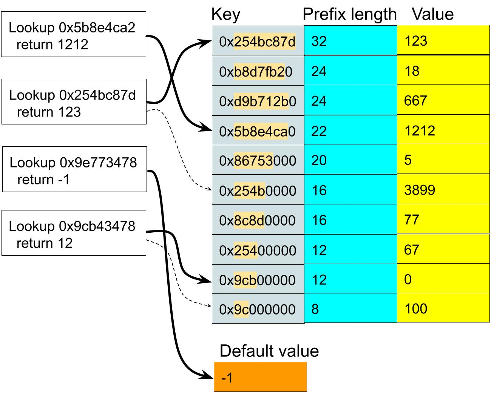
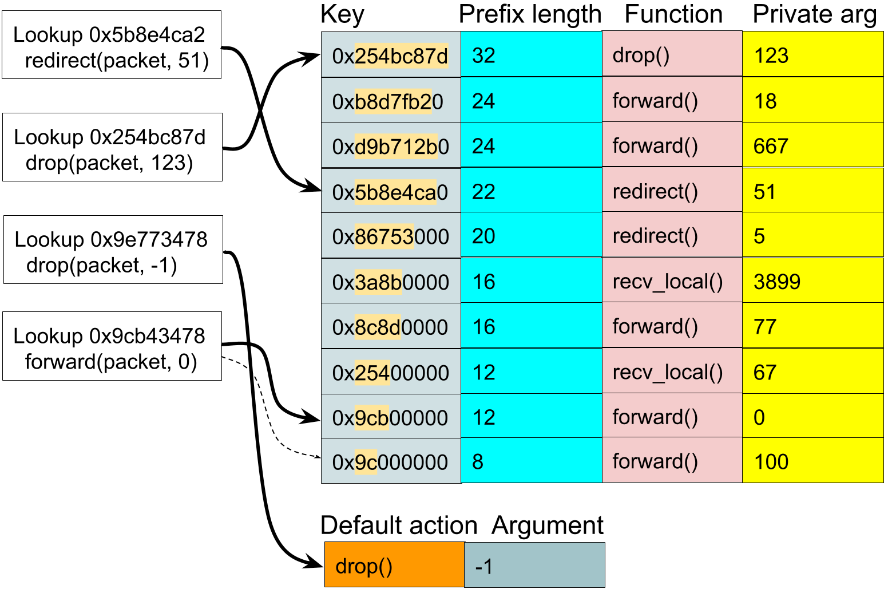

XDP2 Tables
===========

*XDP2 Tables* is an API for programming and using lookup tables. Lookup tables
are extremely common in the datapath. For instance, a router performs
a longest prefix match on a packet's IP addresses to determine the next hop
when forwarding, a firewall might perform a lookup in table containing a set
of rules for matching fields of packets to be dropped, etc. The goal of XDP2
Tables is to define an easy-to-use programmatic API for lookup tables. The API
specifies the characteristics and entries of a table, but does not specify the
implementation. The idea is that the API abstracts out the details of the
underlying implementation and hardware so that backend compilers can map the
table definition in a program into a target instantiation for highest
performance and efficiency per the capabilities of the target. Effectively this
means that the programmer's definition of a table is maintained as an abstract
construct through the intermediate representation.

Lookup tables
=============

A lookup table, also known as a look-up table (LUT), is a data structure that
maps input values to output values or actions. A table is composed of a set of
entries where each is defined by structure that includes fields to be matched
in a lookup operation. The input data to the lookup function table is called a
*key*, and is compared against the fields in the table entries. The lookup
function runs an algorithm to determine the best match for a key among the
entries. An algorithm includes a *compare function* that compares the input key to an entry. We can express this as:

```C
if (COMPARE_FUNCTION(key, entry))
   /* Entry was matched */
else
   /* Entry was not matched */
```

There are different types of lookup tables where the type specifies an
algorithm for comparing the key data to the matching data in an entry.

Exact match tables
------------------

In an *exact match* table the bits of the key are compared against those of the
entry's field to be matched. If all the bits are the same then the entry is
matched. We can express the exact match compare function as:

```C
if (key == entry.match_field)
   /* Entry was matched */
else
   /* Entry was not matched */
```

A lookup function for exact match for a 64-bit key might be simply implemented
as:

```C
struct entry *exact_match_lookup(struct exact_match_table *table, __u64 key)
{
	struct entry *entry;
	int i;

	for (i = 0; i < table->num_entries; i++) {
		entry = &table->entries[i];
		if (key == entry->match_field)
			return entry;
	}

	return NULL;
}
```

In this example the lookup table is implemented as a simple array. To do a
lookup we just run through the array elements and return at the first match.
Note that it's possible that more than one entry could match and we just return
the first one (this case isn't really very interesting for exact match tables).

The simplistic algorithm is **O**(*N*) where *N* is the number of elements in
the table. The table could be structured as a simple binary tree that would get
the algorithmic cost down to **O**(**log** *N*). Another popular technique is
a hash table which has time complexity of **O**(*N*) but in practice can be
structured to be more like **O**(1) if the number of hash buckets is properly
sized. With exact match a CAM could be used to implement the table to give
**O**(1) time, but that has constraints on the key size and number of entries.

<figure class="image">
    
    <figcaption> Exact match key-value lookup table. On the right is a
    lookup table populated with key-value pairs, and a default value set for
    the table. On the left are four example lookups and the values are
    returned. Three of the lookups are matched in the table, one is not
    matched so the default value is returned. Note that the key for the second
    lookup matches two entries, so the value of the first match in the array
    is returned.
    </figcaption>
</figure>

Ternary tables
--------------

A *ternary table* works similarly to exact match tables except that a mask
specific to each entry is applied to the key and the match fields before
comparing the values. A match is declared if all the bits that were masked are
the same in the input key. We can express the ternary compare function as:

```C
if ((key & entry.mask) == (entry.match_field & entry.mask))
   /* Entry was matched */
else
   /* Entry was not matched */
```

A lookup function for a ternary table with a 64-bit key might be implemented as:
```C
struct entry *ternary_table_lookup(struct exact_match_table *table, __u64 key)
{
	int i;

	for (i = 0; i < table->num_entries; i++)
		entry = &table->entries[i];
		if ((key & entry->mask) == (key & entry->match_field))
			return entry;
	}

	return NULL;
}
```

This function is similar to the one for exact match. The only difference is
that we apply a mask to the key and entry's match field when doing the compare.
Similar to exact match tables, multiple entries could match the same key but
for ternary match tables this is much more interesting. A key might match two
entries that have different masks. There is no obvious way to pick which is the
better match, so we rely on the order in the table. The first matching entry is
considered the best one.

The simplistic algorithm is **O**(*N*) where *N* is the number of elements in
the table. The table could be structured as a prefix tree or trie with
**O**(*M*) complexity where *M* is the number of bits in the key. In hardware
we can use a *Ternary CAM*, or *TCAM*, where match data has three states: **0**,
**1**, **X** (don't case). The don't care state provides the functionality of
a mask. The time complexity of TCAM is **O**(1) but TCAM has more constraints
and cost than a CAM.

<figure class="image">
    
    <figcaption> Ternary match key-value lookup table. On the right is a
    lookup table populated with a key, value, and mask for each entry, and a
    default value set for the table. The masked bits in the keys are
    highlighted (these are the bits that must match). On the left are four
    example lookups and what values are returned. Three of the lookups are
    matched in the table, one is not matched so the default value is returned.
    The keys for the first and second lookup match two entries so the value of
    the first matched entry in the array is returned.
    </figcaption>
</figure>

Longest Prefix Match
--------------------

A *Longest Prefix Match*, or *LPM*, table finds the entry with the longest
prefix that matches the key. Each entry includes a *prefix length*. A key
matches an entry if the first bits of the key through the prefix length match
the first bits of the entry through the prefix length. We can express the LPM
compare function as:

```C
mask = (1 << entry.prefix_length) - 1;
if ((key & mask) == (entry.match_field & mask))
   /* Entry was matched */
else
   /* Entry was not matched */
```

A lookup function for longest prefix match table might be simply implemented as:
```C
struct entry *lpm_lookup(struct exact_match_table *table, __u64 key)
{
	unsigned int longest_prefix = 0;
	struct entry *best_entry = NULL;
	__u64 mask;
	int i;

	for (i = 0; i < table->num_entries; i++) {
		entry = &table->entries[i];

		if (entry->prefix_len >= 64)
			mask = -1UU;
		else
			mask = (1ULL << entry->prefix_len) - 1;

		if ((key & mask) == (entry->match_field & mask) &&
		    entry->prefix_len > longest_prefix) {
			best_entry = entry;
			longest_prefix = entry->prefix_len;
		}
	}

	return best_entry;
}
```

Again we use an array to scan the elements of the table. We add two variables
to aid in the search: *longest_prefix* holds the longest prefix of a matching
entry found, *best_entry* holds a pointer to the matching entry with the
longest prefix. These are initialized to zero and NULL, and when the first
match is found they are updated per the matching entry. Subsequently, if a
matching entry with a longer prefix is found then the variables are be updated
for that entry.

The algorithm is otherwise straightforward. For each entry we compute a mask
based on the prefix length in the entry. Next we apply the mask to both the key
and the entry match field. If the masked values are equal and the prefix length
in the entry is longer than the longest prefix length found so far, then the
entry becomes the candidate (*longest_prefix* and *best_entry* are set per the
matching entry). Once the loop completes we return the value in *best_entry*
which will be non-NULL if at least one entry was matched, or NULL if no
entries were matched.

The LPM algorithm we described is **O**(*N*) complexity. We could sort the list
by prefix length from longest to shortest so that we can return on the first
match found and obviate the need for the *longest_prefix* and *best_entry*
variables (but that's still **O**(*N*)). Since Longest Prefix Match is
fundamental to route lookup, and hence fundamental to routers, a lot of work
has gone into optimizing LPM lookups. A prefix tree, or Patricia tree, has
**O**(*L*) complexity where *L* is the number of bits in the key. For instance,
for a route lookup on an IPv6 address the complexity is **O**(128) since IPv6
addresses are 128 bits. Hash tables and TCAMs may also be used with different
tradeoffs.

<figure class="image">
    
    <figcaption> Longest Prefix Match key-value lookup table. On the right is
    a lookup table populated with a key, value, and prefix length for each
    entry, and a default value set for the table. The masked prefix bits in
    the key are highlighted (these are the bits that must match). On the left
    are four example lookups and what values are returned. Three of the lookups
    are matched in the table, one is not matched so the default value is
    returned. Note that the keys for the second and fourth lookup match two
    entries so the value of the first match in the array is returned — this
    works since the lookup entries are sorted by longest to shortest prefix.
    </figcaption>
</figure>

Key-value and match-action tables
---------------------------------

There are two models with respect to behavior when a match is found in a lookup
table: key-value and match-action.

For a *key-value* table, a table lookup returns a value to the caller. The
returned values are set in each table entry and upon a match the value
associated with the matching entry is returned to the caller. The caller
can then process the returned value as it sees fit. In the case that a lookup
is performed but no match is found then a default value is returned. The
default value is set as a property of the lookup table.

For a *match-action* table, when a table entry is matched in a lookup some
action is taken. For the most part we can think of this as invoking a function
associated with the matched entry. Each table entry includes a reference to a
function, and when an entry is matched the entry’s function is called with
some specified arguments. The arguments of the action function might include
the key that was matched, a reference to the matching entry, and maybe a
pointer to a private data structure set in each entry. When the action function
completes, what happens next is implementation dependent. Program control might
return to the caller, or maybe processing continues at the next stage of a
processing pipeline. In the case that a lookup is performed but no match is
found then a default action may be taken. The default action, or function, is
set as a property of the lookup table.

<figure class="image">
    
    <figcaption> Longest Prefix Match match-action table. On the right is a
    lookup table populated with key, prefix length, an action as a function,
    and a private argument to the function. The table default includes a
    function and its own private argument. The masked prefix bits in the key
    are highlighted (these are the bits that must match). On the left are four
    example lookups and the function that is called as a result of the lookup.
    Three of the lookups are matched in the table, one is not matched so the
    default function is called.
    </figcaption>
</figure>

Static tables API
=================

A *static table* is one that is defined at compile time along with all the
entries for the table. At runtime the table cannot be modified or removed,
and table entries cannot be added, modified, or removed. The advantage of a
static table is that the compiler may optimize it in different ways. A static
table may be of any table type.

Macros to create a static lookup table
--------------------------------------

A static key-value table is created by invoking a macro with the form:
```C
XDP2_STABLE_*_TABLE%(NAME, KEY_ARG_TYPE, KEY_DEF, TARG_TYPE, DEFAULT_TARG)
```

A static match-action table (function table) is created by:
```C
XDP2_SFTABLE_*_TABLE%(NAME, KEY_ARG_TYPE, KEY_DEF, COMMON_ARGS_SIG,
                      COMMON_ARGS_LIST, ACTIONS, DEFAULT_ACTION)
```

In the macro names, **\*** is replaced by **PLAIN**, **TERN**, or **LPM** to
select the table type of plain (aka exact match), ternary table, or longest
prefix match. **\%** is either empty, **_NAME**, **_CAST**, or **_NAME_CAST**
which we describe below.

Common macro arguments are:
* **NAME**: User defined name for the table (e.g. "my_table")
* **KEY_ARG_TYPE**: The argument type for the key. For example, if the
	argument type is "struct iphdr *" then the keys can be derived
	based on that (e.g. ihl, ros, saddr fields to match)
* **KEY_DEF**: Defines the key structure for the table. The key
fields are expressed as a list of field name or tuples. More detail is
provided below

The macros to create a key-value table take these additional arguments:
* **TARG_TYPE**: Type of the target argument
* **DEFAULT_TARG**: Default value returned if no match is found in a lookup

The macros to create a match-action table take these additional arguments:
* **COMMON_ARGS_SIG**: A signature for common arguments that are passed to
	the frontend helper action functions (e.g. "(struct my_ctx *ctx)")
* **COMMON_ARGS_LIST**: The common arguments passed to the frontend helper
	action functions. (e.g. "(ctx)")
* **ACTION**: A list of action functions by name. For example:
	(**drop**, **forward**, **NoAction**)
* **DEFAULT_ACTION**: The invocation of a function called on a lookup
	table miss (e.g. "**Miss**(ctx)")

Key defintions
--------------

The **KEY_DEF** argument defines the key structure for the table. The keys
fields are expressed as a list field names or tuples.

If the macro name does not contain **NAME** or **CAST** then **KEY_DEF** is
a list of field names from the **KEY_ARG_TYPE** structure. The types for
each key field are taken from the key argument structure. For example,
the following could be set to **KEY_DEF** to make a key structure for the
select fields in the Ethernet header (**KEY_ARG_TYPE** is *struct ethhdr \**):
```C
        (
                h_dest,
                h_source,
                h_proto
        )
```

If the macro name contains **NAME** but not **CAST** then **KEY_DEF**
is a list of pairs in the form (\<name\>, \<alt-name\>). *name* is a field
name in **KEY_ARG_TYPE** and *alt-name* is a different name to use in the
key definition structure. For example, alternate names could be used for
the Ethernet key:
```C
        (
                (h_dest, destination),
                (h_source, source),
                (h_proto, protocol)
        )
```

If the macro name contains **CAST** but not **NAME** then **KEY_DEF**
is a list of pairs in the form (\<name\>, \<cast\>). *name* is a field
name in **KEY_ARG_TYPE** and *cast* is a type for the field in the key
definition. *cast* may be unspecified in which case the type is derived
from the field in **KEY_ARG_TYPE**.  The major purpose of the cast is to
set a type for bit-fields in the **KEY_ARG_TYPE** since bit-fields are not
allowed in the key definition structure. For example, we can define a
key structure for the IPv4 header and use a cast for the IPv4 header length
bit-field in *struct iphdr*:
```C
        (
                (ihl, (__u8)),
                (tos,),
                (saddr,),
                (daddr,),
                (ttl,),
                (protocol,)
        )
```

If both **NAME** and **CAST** are present then **KEY_DEF** is a list of
3-tuples like (\<name\>, \<alt-name\>, \<cast\>). This gives each key
definition field an alternate name and a cast type. For example:
```C
        (
                (ihl, mihl, (__u8)),
                (tos, mtos,),
                (saddr, src,),
                (daddr, dst,),
                (ttl, mttl,),
                (protocol, proto,)
        )
```

Key argument type and key structure
-----------------------------------

When a table is created a typedef is defined for the key argument
type and a structure is defined for keys. The key argument typedef is
*\<name\>_key_arg_t* and the key structure is "struct *\<name\>_key_struct*"
where \<name\> is the name of the table. The typedef and structure definition
are used in various functions for arguments and return values.

Macros to create a static lookup table with entries
---------------------------------------------------
The macros to create tables may also include a list of initial entries.
When **ENT** is present in the macro name then the **ENTRIES** argument
hold a list of initial table entries. The form of the macros are:

```C
XDP2_STABLE_*_TABLE%_ENTS(NAME, KEY_ARG_TYPE, KEY_DEF, TARG_TYPE,
                          DEFAULT_TARG, ENTRIES)

XDP2_SFTABLE_*_TABLE%_ENTS(NAME, KEY_ARG_TYPE, KEY_DEF, COMMON_ARGS_SIG,
                           COMMON_ARGS_LIST, ACTIONS, DEFAULT_ACTION, ENTRIES)
```
Where **\*** and **\%** are replaced as described above. The format of the
entries is specific to the table type and the key definition:

* For plain tables an entry has the format as a pair of (\<key\>, \<value\>)
for a key-value table, or (\<key\>, \<function\>) for a match-action table. The
\<function\> is a function invocation with arguments like "foo(ctx, 1)".
The arguments of the function invocation are either variables from the
**COMMON_ARGS_LIST** or constants. For example, the following defines a list
of three entries to initialize an exact match match-action table with an IPv4
key like described above. The *key* has the type of the key definition
structure for the table (i.e. struct *\<name\>_key_struct*). *ctx* is in the
**COMMON_ARGS_LIST** and is an argument to the lookup function for the table.
```C
            (
                ((5, 0x3f, 0x00aaaaaa, 0x00aaaabb, 0xff, IPPROTO_TCP),
               	 forward(ctx, 1)),
                ((5, 0x0c, 0x00aaaaaa, 0x00aaaabb, 0xff, IPPROTO_UDP),
               	 forward(ctx, 2)),
                ((5, 0x0c, 0x00cccccc, 0x00ccccdd, 0x0f, IPPROTO_UDP),
               	 NoAction(ctx))
            )
```
* For ternary tables an entry has the format as a tuple of:
(\<key\>, \<key-mask\>, \<value\>) for a key-value table or
(\<key\>, \<key-mask\>, \<function\>) for a match-action table. For instance,
the following defines a list of two entries to initialize a ternary
match-action table with an IPv4 key like described above. The *key* and the
*key-mask* have the type of the key definition structure for the table
(i.e. struct *\<name\>_key_struct*). *frame* and *seqno* are in
**COMMON_ARGS_LIST** and are arguments to the lookup function for the table.
```C
	    (
		(
		  ( {{{ 0x20, 0x01, 0x00, 0x00, 0x5e, 0xf5, 0x79, 0xfd,
		        0x38, 0x0c, 0x1d, 0x57, 0xa6, 0x01, 0x24, 0xfa }}},
		    {{{ 0x20, 0x01, 0x06, 0x7c, 0x21, 0x58, 0xa0, 0x19,
		        0x00, 0x00 , 0x00, 0x00 , 0x00, 0x00 , 0x0a, 0xce }}},
		    __cpu_to_be16(13788), __cpu_to_be16(53104)),
		  ( {{{ 0x20, 0x01, 0x00, 0x00, 0x5e, 0xf5, 0x79, 0xfd,
		        0x38, 0x0c, 0x1d, 0x57, 0xa6, 0x01, 0x24, 0xfa }}},
		    {{{ 0x20, 0x01, 0x06, 0x7c, 0x21, 0x58, 0xa0, 0x19,
		        0x00, 0x00 , 0x00, 0x00 , 0x00, 0x00 , 0x0a, 0xce }}},
		    __cpu_to_be16(13788), __cpu_to_be16(53104)),
		  hit(frame, seqno, 6, 0)),
		),
		(
		  ( {{{ 0x20, 0x01, 0x00, 0x00, 0x5e, 0xf5, 0x79, 0xfd,
		        0x38, 0x0c, 0x1d, 0x57, 0xa6, 0x01, 0x24, 0xfa }}},
		    {{{ 0x20, 0x01, 0x06, 0x7c, 0x21, 0x58, 0xa0, 0x19,
		        0x00, 0x00 , 0x00, 0x00 , 0x00, 0x00 , 0x0a, 0xce }}},
		    __cpu_to_be16(13788), __cpu_to_be16(53104)),
		  ( {{{ 0x20, 0x01, 0x00, 0x00, 0x5e, 0xf5, 0x79, 0xfd,
		        0x38, 0x0c, 0x1d, 0x57, 0xa6, 0x01, 0x24, 0xfa }}},
		    {{{ 0x20, 0x01, 0x06, 0x7c, 0x21, 0x58, 0xa0, 0x19,
		        0x00, 0x00 , 0x00, 0x00 , 0x00, 0x00 , 0x0a, 0xce }}},
		    __cpu_to_be16(13788), __cpu_to_be16(53104)),
		  hit(frame, seqno, 6, 0)),
		)
	    )
```

* For longest prefix match (LPM) tables an entry has the format as
a tuple of: (\<key\>, \<prefix-length\>, \<value\>) for a key-value table or
(\<key\>, \<prefix-length\>, \<function\>) for a match-action table.
For instance, the following defines a list of two entries to initialize a
LPM key-value table with an IPv4 key like described above.
The *key* has the type of the key definition structure for the table
(i.e. struct *\<name\>_key_struct*), and the prefix length should be a value
less than or equal to the bit-length of the key structure.
```C
	    (
		(
		  ( {{{ 0x20, 0x01, 0x00, 0x00, 0x5e, 0xf5, 0x79, 0xfd,
		        0x38, 0x0c, 0x1d, 0x57, 0xa6, 0x01, 0x24, 0xfa }}},
		    {{{ 0x20, 0x01, 0x06, 0x7c, 0x21, 0x58, 0xa0, 0x19,
		        0x00, 0x00 , 0x00, 0x00 , 0x00, 0x00 , 0x0a, 0xce }}},
		    __cpu_to_be16(13788), __cpu_to_be16(53104)),
		    17, 5),
		),
		(
		  ( {{{ 0x20, 0x01, 0x00, 0x00, 0x5e, 0xf5, 0x79, 0xfd,
		        0x38, 0x0c, 0x1d, 0x57, 0xa6, 0x01, 0x24, 0xfa }}},
		    {{{ 0x20, 0x01, 0x06, 0x7c, 0x21, 0x58, 0xa0, 0x19,
		        0x00, 0x00 , 0x00, 0x00 , 0x00, 0x00 , 0x0a, 0xce }}},
		    __cpu_to_be16(13788), __cpu_to_be16(53104)),
		  22, 10),
		)
	    )
```

Adding static entries at compile time
-------------------------------------

When a stack table is declared entries can be added at compile using
sections. The macros for this have the form:

```C
XDP2_STABLE_ADD_PLAIN_MATCH(NAME, KEY, TARGET)

XDP2_STABLE_ADD_TERN_MATCH(NAME, KEY, KEY_MASK, TARGET)

XDP2_STABLE_ADD_LPM_MATCH(NAME, KEY, PREFIX_LEN, TARGET)

XDP2_SFTABLE_ADD_PLAIN_MATCH(NAME, KEY, FUNCTION, COMMON_SIG)

XDP2_SFTABLE_ADD_TERN_MATCH(NAME, KEY, KEY_MASK, FUNCTION, COMMON_SIG)

XDP2_SFTABLE_ADD_LPM_MATCH(NAME, KEY, PREFIX_LEN, FUNCTION, COMMON_SIG)
```

"STABLE" variants are used with key-value tables, and the "SFTABLE" variants
are used with match-action tables. The arguments should be self descriptive.

Performing lookups on static tables
-----------------------------------

When a static table is defined lookup functions are created. These are
named as the name of the table followed by **_lookup** or **_lookup_by_key**.
The _lookup functions perform a lookup on a key argument type, for instance
an IPv4 header as in the examples above. The _lookup_by_key variant performs the
lookup with a key type for the table. The \<common_arg\> is a list of
arguments containing variables from **COMMON_SIG** or constants.

```C
<name>_lookup(const <name>_key_arg_t key_arg, <common_args, ...)
<name>_lookup_by_key(const struct <name_key_struct *key, <common_args>, ...)
```

The first variant performs a lookup with key argument type. For instance,
in the example above the key argument might be an IPV4 header pointer, so an
IPv4 header might be passed as the lookup argument. Internally, the lookup
function creates a proper table key by extracting the key from the input
argument.

The "lookup_by_key" takes a well formed key as an argument. A "make key"
helper function is defined to build a key from a key arg:
```C
void <name>_make_key(const <name>_key_arg_t key_arg,
		     struct <name_key_struct *key);
```

Example: key-value table
------------------------

As an example of static tables, we create a key-value table to perform an
exact match lookup on select fields from the IPv4 header.
**XDP2_STABLE_PLAIN_TABLE_NAME_CAST_ENTS** is invoked with a
target type of **__u32** and default return value of **-1U**. We also
create two entries.

```C
XDP2_STABLE_PLAIN_TABLE_NAME_CAST_ENTS(
        my_ipv4_table,		/* Table name */
        struct iphdr *,		/* Key arg type */
        (			/* Key definition */
                (ihl, mihl, (__u8)),
                (tos, mtos,),
                (saddr, src,),
                (daddr, dst,),
                (ttl, mttl,),
                (protocol, proto,)
        ), __u32, -1U,		/* Target type and default value */
        (			/* Table entries */
             (( 5, 0x3f, 0x00aaaaaa, 0x00aaaaaa, 0xff, IPPROTO_TCP ), 1),
             (( 5, 0x3f, 0x00bbbbbb, 0x00bbbbcc, 0x3f, IPPROTO_UDP ), 0)
        )
)
```

The macro creates some definitions:

```C
typedef  struct iphdr *my_ipv4_lpm_table_t;

struct my_ipv4_lpm_table_key_struct {
	__u8 mihl;
	__u8 mtos;
	__be32 src;
	__be32 dst;
	__u8 mttl;
	__u8 proto;
};

__u32 my_ipv4_lpm_table_lookup(my_ipv4_lpm_table_t arg);

__u32 my_ipv4_lpm_table_lookup_by_key(
			const struct my_ipv4_lpm_table_key_struct key);

void my_ipv4_lpm_table_make_key(my_ipv4_lpm_table_t arg,
				const struct my_ipv4_lpm_table_key_struct key);

```

And then we can perform lookups like:

```C
retval = my_ipv4_lpm_table_lookup(iphdr_ptr);

struct my_ipv4_lpm_table_key_struct key;
my_ipv4_lpm_table_make_key(iphdr_ptr, &key);
retval = my_ipv4_lpm_table_lookup_by_key(key);
```

Example: match-action table
---------------------------

As another example of static tables, we create a match-action table to perform
an exact match lookup on select fields from the Ethernet header.
**XDP2_SFTABLE_PLAIN_TABLE** is invoked. The common args signature is a 'struct
my_ctx *ctx, and so the common argument list is "ctx". The common arguments
allow information in arguments arguments to the lookup function to be passed 
through to the target functions. We define three action functions and the Miss
function is set as the default for a lookup miss. We also add two entries using
the ADD-ENTRY macro.


```C
void forward(struct my_ctx *ctx, int v)
{
    ...
}

void drop(struct my_ctx *ctx)
{
    ...
}

void Miss(struct my_ctx *ctx)
{
    ...
}

XDP2_SFTABLE_PLAIN_TABLE(
        my_eth_table,		/* Table name */
        struct ethhdr *,	/* Key arg type */
        (			/* Key definition */
                h_dest,
                h_source,
                h_proto
        ),
        (struct my_ctx *ctx),	/* Common args signature */
        (ctx),			/* Common args list */
        (drop, forward, Miss),	/* Actions list */
        Miss(ctx)		/* Default action */
)


XDP2_SFTABLE_ADD_PLAIN_MATCH(my_eth_table,
                ( ( { 0x0, 0x11, 0x11, 0x11, 0x11, 0x11 },
                    { 0x0, 0x11, 0x11, 0x11, 0x11, 0x22 }, ETH_P_IP ),
                  forward(ctx, 1), (struct my_ctx *ctx))

XDP2_SFTABLE_ADD_PLAIN_MATCH(my_eth_table,
                ( ( { 0x0, 0x22, 0x22, 0x22, 0x22, 0x22 },
                    { 0x0, 0x22, 0x22, 0x22, 0x22, 0x33 }, ETH_P_IP ),
                  drop(ctx), (struct my_ctx *ctx))

```

The macro creates some definitions:
```C
typedef struct iphdr *my_eth_table_t;

struct my_eth_table_key_struct {
	__u8 h_dest[6];
	__u8 h_source[6];
	__be16 h_proto;
};

void my_eth_table_lookup(my_ipv4_lpm_table_t arg, struct my_ctx *ctx);

void my_eth_table_make_key(my_ipv4_lpm_table_t arg,
                           struct my_ipv4_lpm_table_key_struct *key);

void my_eth_table_lookup_by_key(
                       struct my_ipv4_lpm_table_key_struct *key,
                       struct my_ctx *ctx);

```

And then we can perform lookups like:

```C
retval = my_eth_table_lookup(ethhdr_ptr, &my_ctx);

struct my_eth_table_key_struct key;
my_eth_table_make_key(iphdr_ptr, &key);
retval = my_eth_table_lookup_by_key(key, &ctx);
```

The result of a lookup is that a function is called per the found entry or
the default function on a lookup miss. The function arguments are specified
in the entry definition and may include variables in the common arguments
or constants (like the forward function above).

Dynamic tables API
==================

A dynamic table is one that is defined at runtime. A program can create tables
and remove them at will, and also add entries or remove them as it sees fit.

Creating a dynamic table
------------------------

A dynamic key-value table is created by:
```C
XDP2_DTABLE_*_TABLE%(NAME, KEY_ARG_TYPE, KEY_DEF, TARG_TYPE, DEFAULT_TARG,
		     CONFIG)
```

A dynamic match-action table (function table) is created by:
```C
XDP2_DFTABLE_*_TABLE%(NAME, KEY_ARG_TYPE, KEY_DEF, DEFAULT_FUNC, CONFIG)
```

The **NAME**, **KEY_ARG_TYPE**, and **KEY_DEF** arguments have the equivalent
semantics of the same name arguments in static table macros (i.e.
XDP2_STABLE_\*_TABLE\% and XDP2_SFTABLE_\*_TABLE\% macros). The **CONFIG**
argument that may contain a list of additional configuration parameters such
as maximum number of entries or expected change rate. An empty configuration
argument is **()** and an example non-empty argument might be something like
(.max_entries = 1000, .change_rate = 0.1).

For creating a key-value table the **TARG_TYPE** gives the type of the
return value from a lookup and **DEFAULT_TARG** is the default value
returned on a tbal miss.

For creating a match-action table the **DEFAULT_FUNC** is a pointer
to a *struct __xdp2_dtable_entry_func_target*. This structure is defined as:
```C
struct __xdp2_dtable_entry_func_target {
        xdp2_dftable_func_t func;
        void *arg;
};

typedef void (*xdp2_dftable_func_t)(void *call_arg, void *entry_arg);
```

There are also functions to create tables that may be called from a
running program.

```C
struct xdp2_dtable_plain_table *xdp2_dtable_create_plain(
                const char *name, size_t key_len, void *default_target,
                size_t target_len, int *ident);

struct xdp2_dtable_tern_table *xdp2_dtable_create_tern(
                const char *name, size_t key_len, void *default_target,
                size_t target_len, int *ident);

struct xdp2_dtable_lpm_table *xdp2_dtable_create_lpm(
                const char *name, size_t key_len, void *default_target,
                size_t target_len, int *ident);
```

*name* is the table name, *key_len* is the key  length in bits,
*default_target* is the default target (castable). *ident* returns an
identifier for the table.

Adding an entry to a dynamic tables
-----------------------------------

For a dynamic table there is no initialization of entries when the table is
defined. All entries are added via an add entry function. Helper macros are
defined for this purpose. An entry can be added to a dynamic key-value
table by:
```C
XDP2_DTABLE_ADD_PLAIN(NAME, KEY, TARG)

XDP2_DTABLE_ADD_TERN(NAME, KEY, KEY_MASK, POS, TARG)

XDP2_DTABLE_ADD_LPM(NAME, KEY, PREFIX_LEN, TARG)
```

An entry can be added to a dynamic match-action table by:

```C
XDP2_DFTABLE_ADD_PLAIN(NAME, KEY, FUNC, ARG)

XDP2_DFTABLE_ADD_TERN(NAME, KEY, KEY_MASK, POS, FUNC, ARG)

XDP2_DFTABLE_ADD_LPM(NAME, KEY, PREFIX_LEN, FUNC, ARG)
```

Alternatively, table specific functions can be called. To add an entry to a
key value table:
```C
/* For plain tables */
void <name>_add(const <name>_key_struct key, TARG_TYPE targ)

/* For ternary tables */
void <name>_add(const <name>_key_struct *key, const KEY_TYPE key_mask,
		unsigned int pos, TARG_TYPE targ)

/* For LPM tables */
void <name>_add(const <name>_key_struct *key,
		const <name>_key_struct *key_mask,
		unsigned int pos, TARG_TYPE targ))
```

To add an entry to a match-action table:
```C
/* For plain tables */
void <name>_add(const <name>_key_struct *key,
		xdp2_dftable_func_t func, void *arg)

/* For ternary tables */
void <name>_add(const <name>_key_struct *key,
		const const <name>_key_struct *key_mask,
		unsigned int pos, xdp2_dftable_func_t func,
		void *arg)

/* For LPM tables */
void <name>_add(const <name>_key_struct *key, unsigned int prefix_len,
		xdp2_dftable_func_t func, void *arg)
```


There is also a generic functional interface to add entries.

```C
int xdp2_dtable_add_plain(struct xdp2_dtable_plain_table *table,
                          int ident, const void *key, void *target);

int xdp2_dtable_add_tern(struct xdp2_dtable_tern_table *table,
                         int ident, const void *key, const void *key_mask,
                         unsigned int pos, void *target);

int xdp2_dtable_add_lpm(struct xdp2_dtable_lpm_table *table, int ident,
                        const void *key, size_t prefix_len, void *target);

```

If the return value is less than zero then an error occurred, if the value is
greater than zero than that is an identifier of the entry that may be used
in the functions to change or remove an entry by ID.

Changing an entry
-----------------

The action of value of an existing table entry may be changed.
Table specific functions can be called to change an entry. To add an entry to
a key value table:
```C
/* For plain tables */
void <name>_change(const KEY_TYPE key, TARG_TYPE targ)

/* For ternary tables */
void <name>_change(const KEY_TYPE key, const KEY_TYPE key_mask,
		unsigned int pos, TARG_TYPE targ)

/* For LPM tables */
void <name>_change(const KEY_TYPE key, const KEY_TYPE key_mask,
		unsigned int pos, TARG_TYPE targ))
```

To change an entry to a match-action table:
```C
/* For plain tables */
void <name>_change(const KEY_TYPE key, xdp2_dftable_func_t func, void *arg)

/* For ternary tables */
void <name>_change(const KEY_TYPE key, const KEY_TYPE key_mask,
		unsigned int pos, xdp2_dftable_func_t func,
		void *arg)

/* For LPM tables */
void <name>_change(const KEY_TYPE key, const KEY_TYPE key_mask,
		unsigned int pos, xdp2_dftable_func_t func,
		void *arg)
```

There are general functions for changing a table entry (changing the action
that is).

```C
int xdp2_dtable_change_plain(struct xdp2_dtable_plain_table *table,
                             const void *key, void *target);

int xdp2_dtable_change_plain_by_id(struct xdp2_dtable_plain_table *table,
                                   int ident, void *target);

int xdp2_dtable_change_tern(struct xdp2_dtable_tern_table *table,
                            const void *key, const void *key_mask,
                            unsigned int pos, void *target);

int xdp2_dtable_change_tern_by_id(struct xdp2_dtable_tern_table *table,
                                  int ident, void *target);

int xdp2_dtable_change_lpm(struct xdp2_dtable_lpm_table *table,
                           const void *key, size_t prefix_len, void *target);

int xdp2_dtable_change_lpm_by_id(struct xdp2_dtable_lpm_table *table,
                                 int ident, void *target);
```

Removing an entry
-----------------
There are functions to remove an entry from a lookup table.

```C
void xdp2_dtable_del_plain(struct xdp2_dtable_plain_table *table,
                           const void *key);

void xdp2_dtable_del_plain_by_id(struct xdp2_dtable_plain_table *table,
                                 int ident);

void xdp2_dtable_del_tern(struct xdp2_dtable_tern_table *table,
                          const void *key, const void *key_mask,
                          unsigned int pos);

void xdp2_dtable_del_tern_by_id(struct xdp2_dtable_tern_table *table,
                                int ident);

void xdp2_dtable_del_lpm(struct xdp2_dtable_lpm_table *table,
                         const void *key, size_t prefix_len);

void xdp2_dtable_del_lpm_by_id(struct xdp2_dtable_lpm_table *table, int ident);
```
Alternatively, table specific functions can be called. To remove an entry from a
table:
```C
/* For plain tables */
void <name>_remove(const KEY_TYPE key)

/* For ternary tables */
void <name>_remove(const KEY_TYPE key, const KEY_TYPE key_mask,
		unsigned int pos)

/* For LPM tables */
void <name>_remove(const KEY_TYPE key, const KEY_TYPE key_mask,
		unsigned int pos
```

Example
-------

As an example of dynamic tables, we create a match-action table to perform an
exact match lookup on select fields from the IPv4 header.
**XDP2_STABLE_LPM_TABLE_NAME_CAST_ENTS** is invoked with a
target type of **__u32** and default return value of **-1U**. We also
create two entries.

```C
XDP2_DFTABLE_PLAIN_TABLE(
        my_eth_table,		/* Table name */
        struct ethhdr *,	/* Key arg type */
        (			/* Key definition */
                h_dest,
                h_source,
                h_proto
        ), Miss_dtable,		/* Default function */
	()			/* Extra configuration (empty) */
)
```

The macro creates some definitions:

```C
typedef  struct ethhdr *my_eth_table_t;

struct my_eth_table_key_struct {
	
	__u8 mihl;
	__u8 mtos;
	__be32 src;
	__be32 dst;
	__u8 mttl;
	__u8 proto;
};

__u32 my_ipv4_lpm_table_lookup(my_ipv4_lpm_table_t arg);

__u32 my_ipv4_lpm_table_lookup_by_key(
			struct my_ipv4_lpm_table_key_struct *key);

void my_ipv4_lpm_table_make_key(my_ipv4_lpm_table_t arg,
				struct my_ipv4_lpm_table_key_struct *key);

```

And then we can perform lookups like:

```C
retval = my_ipv4_lpm_table_lookup(iphdr_ptr);

struct my_ipv4_lpm_table_key_struct key;
my_ipv4_lpm_table_make_key(iphdr_ptr, &key);
retval = my_ipv4_lpm_table_lookup_by_key(iphdr_ptr);
```

SKEY variants
=============

Both statics tables can be defined without a key argument, basically the
key definition and the key argument are the same thing. THis allows creating
tables with custom keys. The macros to create a static SKEY table are shown
below. THe arguments have the same semantics as those for regular static tables
macros.

```C
XDP2_SFTABLE_*_TABLE_SKEY(NAME, KEY_ARG_TYPE, COMMON_ARGS_SIG,
			  COMMON_ARGS_LIST, ACTIONS, DEFAULT_ACTION)
XDP2_SFTABLE_*_TABLE_SKEY_ENTS(NAME, KEY_ARG_TYPE, COMMON_ARGS_SIG,
			       COMMON_ARGS_LIST, ACTIONS, DEFAULT_ACTION,
			       ENTRIES)
XDP2_STABLE_*_TABLE_SKEY(NAME, KEY_ARG_TYPE, TARG_TYPE)
			 COMMON_ARGS_LIST, ACTIONS, DEFAULT_ACTION)
XDP2_STABLE_*_TABLE_SKEY_ENTS(NAME, KEY_ARG_TYPE, TARG_TYPE, ENTRIES)
```

The macros to create a static SKEY table are shown below. The arguments have
the same semantics as those for regular dynamic tables macros.

```C
XDP2_DFTABLE_*_TABLE_SKEY_DEFINE(NAME, DEFAULT_ACTION, CONFIG)
XDP2_DFTABLE_*_TABLE_SKEY(NAME, KEY_ARG_TYPE, DEFAULT_ACTION, CONFIG)
```

All lookups for SKEY tables are performed with a key as input, so the
**_lookup_by_key** functions are created for SKY tables. The type of the
key argument is the **KEY_ARG_TYPE** specified in the macro that created
the table.

```C
<name>_lookup_by_key(const struct user_defined_key *key, <common_args>, ...)
```

The add, change, and remove entry functions for SKEY are defined and
have the same signature and semantics of the functions for regular
dynamic tables.

SKEY Example
-------------

```C
typedef  struct iphdr *my_ipv4_lpm_table_t;

struct my_ipv4_lpm_table_key_struct {
	__u8 mihl;
	__u8 mtos;
	__be32 src;
	__be32 dst;
	__u8 mttl;
	__u8 proto;
};

__u32 my_ipv4_lpm_table_lookup(my_ipv4_lpm_table_t arg);

__u32 my_ipv4_lpm_table_lookup_by_key(
			struct my_ipv4_lpm_table_key_struct *key);

void my_ipv4_lpm_table_make_key(my_ipv4_lpm_table_t arg,
				struct my_ipv4_lpm_table_key_struct *key);

```

And then we can perform lookups like:

```C
retval = my_ipv4_lpm_table_lookup(iphdr_ptr);

struct my_ipv4_lpm_table_key_struct key;
my_ipv4_lpm_table_make_key(iphdr_ptr, &key);
retval = my_ipv4_lpm_table_lookup_by_key(iphdr_ptr);
```

Example: match-action table
---------------------------

As another example of static tables, we create a match-action table to
perform an exact match lookup on select fields from the Ethernet header.
**XDP2_SFTABLE_PLAIN_TABLE** is invoked. The common args signature
is a 'struct my_ctx *ctx, and so the common argument list is "ctx". The
common arguments allow information to be passed as arguments to the lookup
function that are passed through to the target functions. We define three
action functions and Miss is set as the default for a lookup miss. We
also add two entries using the ADD-ENTRY macro.


```C
void forward(struct my_ctx *ctx, int v)
{
    ...
}

void drop(struct my_ctx *ctx)
{
    ...
}

void Miss(struct my_ctx *ctx)
{
    ...
}

XDP2_SFTABLE_PLAIN_TABLE(
        my_eth_table,		/* Table name */
        struct ethhdr *,	/* Key arg type */
        (			/* Key definition */
                h_dest,
                h_source,
                h_proto
        ),
        (struct my_ctx *ctx),	/* Common args signature */
	(ctx),			/* Common args list */
        (drop, forward, Miss),	/* Actions list */
        Miss(ctx)		/* Default action */
)


XDP2_SFTABLE_ADD_PLAIN_MATCH(my_eth_table,
                ( ( { 0x0, 0x11, 0x11, 0x11, 0x11, 0x11 },
		    { 0x0, 0x11, 0x11, 0x11, 0x11, 0x22 }, ETH_P_IP ),
		  forward(ctx, 1), (struct my_ctx *ctx))

XDP2_SFTABLE_ADD_PLAIN_MATCH(my_eth_table,
                ( ( { 0x0, 0x22, 0x22, 0x22, 0x22, 0x22 },
		    { 0x0, 0x22, 0x22, 0x22, 0x22, 0x33 }, ETH_P_IP ),
		  drop(ctx), (struct my_ctx *ctx))

```

The macro creates some definitions:
```C
typedef  struct iphdr *my_eth_table_t;

struct my_eth_table_key_struct {
	__u8 h_dest[6];
	__u8 h_source[6];
	__be16 h_proto;
};

void my_eth_table_lookup(my_ipv4_lpm_table_t arg, struct my_ctx *ctx);

void my_eth_table_make_key(my_ipv4_lpm_table_t arg,
				struct my_ipv4_lpm_table_key_struct *key);

void my_eth_table_lookup_by_key(
			struct my_ipv4_lpm_table_key_struct *key,
			struct my_ctx *ctx);

```

And then we can perform lookups like:

```C
retval = my_eth_table_lookup(ethhdr_ptr, &my_ctx);

struct my_eth_table_key_struct key;
my_eth_table_make_key(iphdr_ptr, &key);
retval = my_eth_table_lookup_by_key(ethhdr_ptr, &my_ctx);
```

The result of a lookup is that a function is called per the found entry or
the default function on a lookup miss. The function arguments are specified
in the entry definition and may include variables in the common arguments
or constants (like the forward function above).

Tables Test
===========

[test/tables](../src/test/tables) contains a test of all the various tables.
It can be ran by:
```
$ ./test_tables
```

And it can be ran with verbose output:
```
$ ./test_tables -v 10
Base eth (eth_stable_plain): Forward code: 2
eth_stable_plain:0: Forward code: 2
eth_stable_plain:0: Forward code: 2
eth_stable_plain_ents:0: Forward code: 2
eth_stable_plain_ents:0: Forward code: 2
eth_stable_plain_name:0: Forward code: 2
eth_stable_plain_name:0: Forward code: 2
eth_stable_plain_name_ents:0: Forward code: 2
eth_stable_plain_name_ents:0: Forward code: 2
eth_stable_plain_skey:0: Forward code: 2
eth_stable_plain_skey_ents:0: Forward code: 2
Base eth (eth_stable_plain): Miss
eth_stable_plain:1: Miss
eth_stable_plain:1: Miss
eth_stable_plain_ents:1: Miss
eth_stable_plain_ents:1: Miss
eth_stable_plain_name:1: Miss
eth_stable_plain_name:1: Miss
eth_stable_plain_name_ents:1: Miss
eth_stable_plain_name_ents:1: Miss
eth_stable_plain_skey:1: Miss
eth_stable_plain_skey_ents:1: Miss
Base eth (eth_stable_plain): Miss
eth_stable_plain:2: Miss
eth_stable_plain:2: Miss
eth_stable_plain_ents:2: Miss
eth_stable_plain_ents:2: Miss
eth_stable_plain_name:2: Miss
eth_stable_plain_name:2: Miss
eth_stable_plain_name_ents:2: Miss
eth_stable_plain_name_ents:2: Miss
eth_stable_plain_skey:2: Miss
eth_stable_plain_skey_ents:2: Miss

<<< and so on >>>
```
